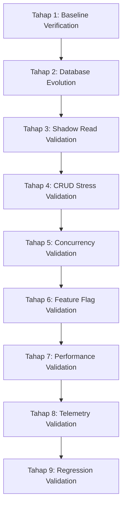

# Development Validation Roadmap: GTT Invoice Module

This document outlines the validation framework and testing protocols used to verify the architectural evolution and stability of the GTT Invoice Module (Phase 0–3F) in the local development environment.

---

## 1. 9-Stage Local Validation Protocol

### Tahap 1: Baseline Verification
* **Objective**: Confirm the codebase compiles cleanly and all existing test suites pass.
* **Checklist**:
  - [x] TypeScript compilation check passes on the frontend package.
  - [x] TypeScript compilation check passes on the backend package.
  - [x] Backend unit tests pass (`npm run test --workspace backend`).
  - [x] Frontend unit tests pass (`npm run test:unit --workspace frontend`).
  - [x] E2E Playwright integration tests pass (`npx playwright test diagnostics.spec.ts`).

### Tahap 2: Database Evolution Validation
* **Objective**: Ensure the migrations, schema constraints, and database normalization are correct and idempotent.
* **Checklist**:
  - [x] Prisma database migrations execute successfully without errors.
  - [x] Relational structure constraints (`Invoice` -> `InvoiceItem` ON DELETE CASCADE) are present in PostgreSQL.
  - [x] The cursor-based backfiller successfully migrates historical records from legacy JSON to relational tables.
  - [x] Backfiller execution is idempotent (can run repeatedly without duplicate records or primary key collisions).
  - [x] Checksum validation: Total items count and amounts match exactly between the JSON fields and relational tables.

### Tahap 3: Shadow Read Validation
* **Objective**: Verify that write operations sync data perfectly between both tables.
* **Checklist**:
  - [x] Create Invoice: Validates correct synchronous writes to both datasets.
  - [x] Edit Invoice: Modifying fields updates both structures.
  - [x] Delete Item: Removing line items deletes relational records and updates JSON arrays.
  - [x] Payment Adjustment: Adding or removing payments updates corresponding metadata in both places.
  - [x] Currency / Status Changes: Changing status to *Cancelled* or updating exchange rates updates both records.
  - [x] Verify that `invoice_shadow_mismatch` counts remain at `0` for all CRUD operations.

### Tahap 4: CRUD Stress Validation
* **Objective**: Validate the system with high volumes of data to discover edge cases.
* **Checklist**:
  - [x] Create 50+ invoices of varying client types, group bindings, items, and currencies.
  - [x] Perform multiple, sequential updates (add, modify, delete items) on various status types (Pending, Paid, Cancelled) to verify stability.

### Tahap 5: Concurrency Validation
* **Objective**: Prove optimistic concurrency controls prevent lost update bugs.
* **Checklist**:
  - [x] Open the same invoice workspace in two separate browser windows.
  - [x] Submit a modification in Window A: Confirm it succeeds and increments the `version` column.
  - [x] Submit a modification in Window B (retaining the outdated version token): Confirm it is rejected with a `409 ConflictException` and triggers a user refresh instruction.
  - [x] Verify that this concurrency check behaves correctly across different payload operations (item updates, payment updates, client updates).

### Tahap 6: Feature Flag Validation
* **Objective**: Ensure toggling read pathways does not degrade data accuracy.
* **Checklist**:
  - [x] Skenario 1: Dual-write active, `ENABLE_NEW_ITEM_READ=false`. JSON and relational tables write successfully, reads fallback to JSON.
  - [x] Skenario 2: Dual-write active, `ENABLE_NEW_ITEM_READ=true`. Reads load data from relational tables; verify details look identical to Skenario 1.

### Tahap 7: Performance Validation
* **Objective**: Ensure that localized rendering scopes and derived states are fast and lag-free.
* **Checklist**:
  - [x] Fast input latency: Typing inside text areas, name fields, or item descriptions is highly responsive.
  - [x] Localized rendering: Adding line items or payments does not trigger unrelated parent or sibling component renders.
  - [x] State derivation: Subtotals, balance remaining, and payment coverages recalculate purely without secondary render effects or syncing loops.
  - [x] Ensure no legacy `useEffect` state syncing code paths exist.

### Tahap 8: Telemetry Validation
* **Objective**: Confirm critical code paths are instrumented.
* **Checklist**:
  - [x] Validate transaction timers (`invoice_transaction_ms`) emit correct timings.
  - [x] Validate database query timers (`invoice_db_query_ms`) emit correct timings.
  - [x] Validate shadow comparison timers (`invoice_shadow_compare_ms`) emit correct timings.
  - [x] Verify that version conflicts log structured `invoice_version_conflict` metrics.

### Tahap 9: Regression Validation
* **Objective**: Prevent side-effects on secondary invoice features.
* **Checklist**:
  - [x] Create / Update / Delete CRUD flows are fully functional.
  - [x] Payment tracking, balance computations, and automatic status transitions behave as expected.
  - [x] Currency conversions (USD/SAR to IDR) and exchange rate adjustments apply correctly.
  - [x] Filters, search queries, and list pagination scopes load correctly.

---

## 2. Definition of Done (Local Development)

The local development refactoring phase is officially marked **Complete** when:
- [x] **TypeScript Compiles Cleanly**: 0 compilation warnings or errors.
- [x] **All Tests Pass**: All unit, contract, concurrency, and E2E specs resolve green.
- [x] **Dual-Write & Backfill Idempotent**: Historical and transactional data are matched without mismatch triggers.
- [x] **Optimistic Locking Active**: Lost updates are blocked, and conflict exceptions are handled gracefully.
- [x] **Zero Syncing Effects**: Syncing `useEffect` code paths are eliminated.
- [x] **Telemetry Instrumented**: Timing and custom event metrics are active on all critical write and comparison layers.
