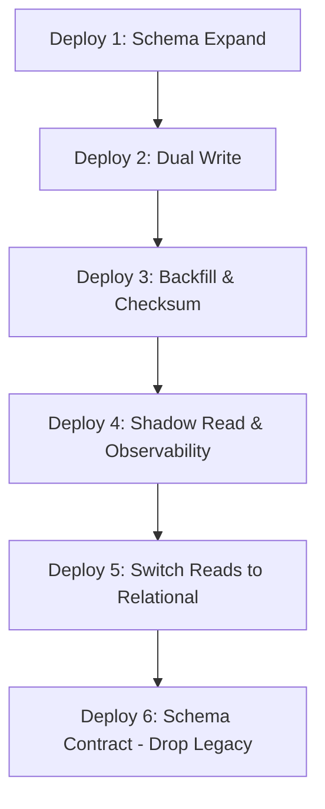

# Production Rollout & Operations Roadmap: Invoice Module

Based on the production hardening completion, the GTT Invoice Module has achieved **Production Ready Candidate** status. This document establishes the operational excellence roadmap, graduation criteria, and gradual step-by-step rollout plan for deployment.

---

## 1. Gradual Production Rollout Plan

To ensure zero-downtime, the rollout is structured across 6 safe deployment milestones.

### Deploy 1: Schema Expand
* **Objective**: Apply database evolution without modifying code paths.
* **Tasks**:
  * Execute Prisma schema migrations to add the `InvoiceItem` table, `version` column to `Invoice` table, and create indexes.
* **Safety**: Application code still reads/writes legacy JSON columns. Fully reversible.

### Deploy 2: Dual Write
* **Objective**: Write incoming data to both JSON and relational tables.
* **Tasks**:
  * Deploy the code update. Write operations (`create`, `update`) write data atomically to both locations using Prisma transactions.
* **Telemetry to Monitor**:
  * `invoice_dual_write_success` vs. `invoice_dual_write_failed`.

### Deploy 3: Backfill & Checksum
* **Objective**: Sync historical records.
* **Tasks**:
  * Run the background cursor-based backfiller.
  * Execute the checksum verification query to verify items count match between JSON and relational tables.
* **Telemetry to Monitor**:
  * `invoice_backfill_rows` and `invoice_backfill_failed`.

### Deploy 4: Shadow Read & Observability
* **Objective**: Read from JSON, compare with relational, and observe behavior.
* **Tasks**:
  * Deploy code with shadow compare telemetry.
  * **Observation Window**: Monitor for 1–2 weeks under real production load.
* **Telemetry to Monitor**:
  * `invoice_shadow_mismatch` (must remain `0`).
  * `invoice_shadow_compare_ms`.

### Deploy 5: Switch Reads (Toggling Feature Flag)
* **Objective**: Change target source of truth for reads.
* **Tasks**:
  * Set `ENABLE_NEW_ITEM_READ=true` in environment configuration.
  * The frontend and backend now read line items from the relational `InvoiceItem` tables.
* **Fallback**: Immediate fallback by resetting `ENABLE_NEW_ITEM_READ=false` if latencies spike.

### Deploy 6: Schema Contract (Phase 3G)
* **Objective**: Permanent cleanup of the legacy column.
* **Tasks**:
  * Drop the `items` JSON column from the `Invoice` schema.
* **Prerequisites**: Minimum 2 weeks of zero shadow mismatches and stable query performance.

---

## 2. Monitoring & Alerting Specifications

### Prometheus & Grafana Dashboard Layout
We will track the following key telemetry points in our monitoring stack:

| Panel Group | Metric Identifier | Visualization | Description |
| :--- | :--- | :--- | :--- |
| **Write Reliability** | `invoice_submit_ms` | Line Graph (p95, p99) | Overall request submission latency |
| | `invoice_transaction_ms` | Line Graph (p95, p99) | DB transaction duration |
| | `invoice_conflict_count` | Counter / Rate | Optimistic locking collision counts |
| **Shadow Verification**| `invoice_shadow_mismatch` | Counter | Differences between JSON and relational reads |
| | `invoice_shadow_compare_ms` | Gauge | Time overhead added by comparison checks |
| **Read Latency** | `invoice_db_query_ms` | Line Graph (p95, p99) | DB read/find queries execution time |

### Alerting Rules Configuration

1. **Version Conflict Spikes**
   * **Rule**: `rate(invoice_conflict_count[1m]) > 10`
   * **Severity**: Warning
   * **Action**: Investigate user concurrent edits or potential frontend submit throttling bypass.
2. **Shadow Mismatch Alert**
   * **Rule**: `invoice_shadow_mismatch > 0`
   * **Severity**: Critical (P0)
   * **Action**: Immediate rollback of read flag; sync mismatching rows using manual backfiller.
3. **Slow Database Transactions**
   * **Rule**: `histogram_quantile(0.95, sum(rate(invoice_transaction_ms_bucket[5m])) by (le)) > 1000`
   * **Severity**: Warning
   * **Action**: Check for table lock contention, unindexed scans, or query bottlenecks.

---

## 3. Load & Failover Testing Scenarios

Before final migration cleanup:
* **Load Test**: Simulate 100 concurrent update requests on a single invoice to verify that the database handles optimistic lock retries within expected performance limits.
* **Chaos / Failover Test**: Simulate database connection drops or execution timeout errors mid-transaction. Verify that no partial writes (e.g., invoice created but relational items missing) persist, proving transactional rollback integrity.
