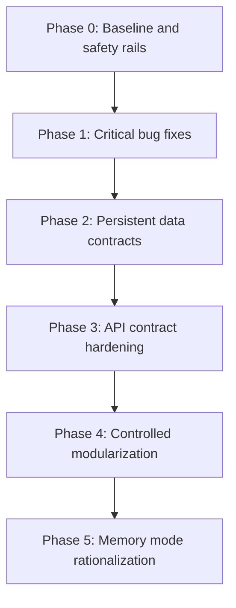

# Safe Refactoring Execution Plan

Tanggal: 2026-06-19
Branch kerja dokumen: `docs/backbone-audit-plan`
Rujukan utama: `docs/project-review-refactoring-assessment.md`

## Execution Status

Status per 2026-06-20:

- Branch integrasi terbaru: `stabilization/backbone-phase-25`.
- `master` tetap tidak disentuh; semua perubahan berjalan di branch konservatif dan bisa diputuskan belakangan apakah akan dibuat PR ke `master`.
- Phase 0 sampai Phase 3 selesai: baseline, bug critical, persistent data contract, dan API contract hardening sudah terintegrasi di branch stabilisasi sebelumnya.
- Phase 4 selesai untuk scope modularisasi aman: domain frontend sudah dipisah bertahap ke module types, fixtures, status, checklist, visa/completeness, itinerary/schedule, serta backend groups API/payload/mapper sudah dipisah bertahap.
- Phase 5 selesai untuk scope rasionalisasi awal: ada contract test groups yang menjalankan skenario yang sama terhadap adapter memory dan Prisma mock, `test:unit` backend menjalankan contract test tersebut, dan `qa:full` sekarang memanggil `test:prisma` secara eksplisit.
- Hardening tambahan disiapkan agar migration drift tidak berubah menjadi error 500 diam-diam: backend `DATA_SOURCE=prisma` melakukan schema readiness check saat startup, dan script `db:status`/`db:deploy:backend` tersedia untuk preflight migration.

Checkpoint terakhir yang sudah diverifikasi:

- `stabilization/backbone-phase-19`: merge `refactor/frontend-group-visa-domain`.
- `stabilization/backbone-phase-20`: merge `refactor/frontend-itinerary-domain`.
- `stabilization/backbone-phase-21`: merge `test/groups-memory-prisma-contract`.
- `stabilization/backbone-phase-22`: merge `docs/backbone-phase-status`.
- `stabilization/backbone-phase-23`: merge `hardening/prisma-schema-readiness`.
- `stabilization/backbone-phase-24`: merge `docs/backbone-phase-23-status`.
- `stabilization/backbone-phase-25`: merge `docs/backbone-phase-24-status`.

Checkpoint lokal/development terbaru di `stabilization/backbone-phase-25`:

- Database PostgreSQL bersih dibuat khusus untuk validasi refactor: `gtt_ops_refactor_20260620_132631`.
- `apps/backend/.env` lokal yang ignored oleh git sudah diarahkan ke database bersih tersebut untuk `npm run dev:backend` dan `npm run start:backend`.
- `npm run db:status --workspace backend` dari `.env` lokal menunjukkan 25 migration repo dan schema up to date.
- `npm run db:deploy --workspace backend` sukses menerapkan 25 migration repo ke database bersih tersebut.
- `npm run test:integration --workspace backend` sukses terhadap database bersih tersebut, termasuk saat dijalankan ulang tanpa override env setelah `.env` lokal diarahkan ke DB clean.
- `npm run qa:full` sukses terhadap database bersih tersebut, termasuk `qa:quick`, build backend/frontend, smoke test frontend, `test:api`, `test:prisma`, dan 9 Playwright E2E frontend.
- `npm run dev:backend` berhasil start dengan TypeScript watcher 0 errors, backend listening di `http://localhost:3001/api`, dan `data source: prisma`.
- `npm run dev:frontend` berhasil start di `http://localhost:4173` dan proxy `/api` mengarah ke `http://127.0.0.1:3001`.
- Halaman frontend dev `GET /` memberi 200, dan `GET /api/groups?projection=summary` lewat frontend proxy tidak lagi 500/502; tanpa sesi login response-nya 401 Unauthorized sesuai guard auth.

Gate kode terakhir di `stabilization/backbone-phase-23`:

```bash
npm run db:generate --workspace backend
npm run check --workspace backend
npm run check --workspace frontend
npm run build --workspace backend
node apps/backend/dist/prisma/prisma.service.test.js
npm run test:unit --workspace frontend
npm run test:smoke --workspace frontend
npm run test:unit --workspace backend
git diff --check
```

Catatan: `npm run test:integration --workspace backend` dan `npm run qa:full` sekarang sudah dijalankan pada database lokal/development yang bersih. Script `qa:full` memastikan Prisma path lewat `test:prisma` sebelum E2E frontend. Checkpoint `stabilization/backbone-phase-22` adalah docs-only dan diverifikasi dengan `git diff --check`; checkpoint `stabilization/backbone-phase-23` menambahkan fail-fast schema readiness agar migration drift terdeteksi saat startup, bukan menjadi 500 di endpoint runtime.

Preflight lokal terbaru:

- `npx prisma migrate status --schema prisma/schema.prisma` dari `apps/backend` mendeteksi migration drift pada database `gtt_ops` di `localhost:5432`.
- Migration repo yang belum diterapkan di DB tersebut: `20260619120000_relax_invoice_client_sort_order`, `20260619133000_add_visa_hotel_agreement_source_draft`, `20260619143000_add_group_lifecycle_status`, `20260619153000_add_visa_setup_bus_status`.
- DB tersebut juga memiliki migration history dari branch lama yang tidak ada di repo sekarang: `20260618172337_fix_invoice_client_sort_order`, `20260618000000_db_improvements`.
- Karena itu, DB drift `gtt_ops` jangan digunakan sebagai bukti production-ready. Untuk validasi lokal/development refactor ini, gunakan database bersih seperti `gtt_ops_refactor_20260620_132631` atau reconcile migration history terlebih dahulu.

## Tujuan

Menjalankan perbaikan backbone project secara bertahap tanpa mengulang kegagalan refactor besar sebelumnya. Fokus utama plan ini adalah menjaga stabilitas production, memperjelas kontrak database-backend-frontend, dan membuat setiap perubahan mudah diverifikasi serta mudah di-rollback.

## Prinsip Kerja

1. Tidak ada refactor besar lintas layer dalam satu PR.
2. Satu PR hanya boleh punya satu tujuan domain yang jelas.
3. Bug/invariant kritikal diperbaiki sebelum modularisasi kode.
4. Migration database harus kecil, additive jika memungkinkan, dan punya rollback path.
5. Tambah regression test sebelum atau bersamaan dengan fix behavior.
6. Frontend high-risk flow menunggu response server; hindari optimistic update untuk agreement, visa, dan parent-child link.
7. Memory mode tidak dijadikan bukti production aman; Prisma path harus punya test sendiri.
8. Setelah pindah branch atau schema berubah, jalankan `npm run db:generate --workspace backend` sebelum type-check.

## Definition of Safe

Perubahan dianggap aman jika memenuhi semua gate berikut:

- Scope PR kecil dan tidak mencampur schema, UI besar, dan refactor struktural sekaligus.
- Ada test untuk behavior yang disentuh.
- `npm run db:generate --workspace backend` sudah dijalankan jika schema/Prisma type berubah.
- `npm run check --workspace backend` lulus.
- `npm run check --workspace frontend` lulus jika frontend tersentuh.
- Minimal targeted unit/integration test lulus.
- Manual verification flow ditulis di PR description.
- Rollback path jelas.

## Branch dan PR Strategy

Gunakan branch kecil dari `master` atau branch integrasi yang disepakati.

Urutan branch yang direkomendasikan:

1. `fix/agreement-draft-stale-link`
2. `fix/invoice-client-sort-order`
3. `fix/group-parent-child-guard`
4. `feat/visa-agreement-source-draft-link`
5. `feat/group-status-contract`
6. `feat/frontend-api-contracts`
7. `refactor/frontend-domain-modules`
8. `refactor/backend-groups-types`

Jangan mulai branch 7 dan 8 sebelum branch 1 sampai 6 selesai atau minimal stabil di staging/local QA.

## Execution Overview



---

## Phase 0 - Baseline and Safety Rails

Tujuan: memastikan kondisi awal sehat sebelum perubahan source code.

### Scope

- Commit dokumen audit dan plan terlebih dahulu.
- Pastikan Prisma Client sinkron dengan schema saat ini.
- Jalankan check minimal.
- Tandai test gap yang harus ditutup sebelum perubahan behavior.

### Tasks

1. Commit dokumen:
   - `docs/backbone-audit-report.md`
   - `docs/project-review-refactoring-assessment.md`
   - `docs/implementation_plan.md`

2. Jalankan baseline commands:

```bash
npm run db:generate --workspace backend
npm run check --workspace backend
npm run check --workspace frontend
```

3. Catat hasil baseline di PR atau commit message.

### Exit Criteria

- Dokumen sudah committed.
- Backend dan frontend type-check lulus.
- Tidak ada source code production yang berubah di phase ini.

---

## Phase 1 - Critical Bug Fixes

Tujuan: menutup bug/invariant paling berbahaya tanpa mengubah arsitektur besar.

### PR 1.1 - Remove stale HotelAgreementDraft group link writes

Problem:

- Migration `20260617061830_remove_group_id_from_hotel_draft` sudah menghapus `HotelAgreementDraft.groupId` dan `assignedAt`.
- `GroupsCommandService.createWithPrisma` masih punya path yang mencoba update `groupId` dan `assignedAt` saat payload membawa `sourceDraftId`.

Files likely touched:

- `apps/backend/src/groups/application/groups-command.service.ts`
- `apps/backend/src/groups/tests/groups.service.prisma-crud.test.ts`
- `apps/backend/src/e2e/backend.prisma.groups.integration.test.ts` jika perlu integration coverage.

Implementation approach:

1. Hapus blok `hotelAgreementDraft.updateMany` yang menulis `groupId`/`assignedAt`.
2. Pastikan create group dengan payload agreement draft tidak crash.
3. Jangan dulu membuat relasi baru di PR ini; itu masuk Phase 2.

Verification:

```bash
npm run db:generate --workspace backend
npm run check --workspace backend
npm run test:unit --workspace backend
```

Manual check:

- Buat group dari flow New Group dengan selected agreement draft.
- Pastikan group tercipta dan agreement masuk ke visa setup.
- Pastikan Agreement Inbox tetap bisa list draft.

Rollback:

- Revert PR ini saja. Tidak ada migration.

### PR 1.2 - Fix InvoiceClient sort order constraint

Problem:

- `InvoiceClient.sortOrder` masih `@@unique([sortOrder])` global.
- Risiko P2002 dan desain tidak fleksibel.

Files likely touched:

- `apps/backend/prisma/schema.prisma`
- New Prisma migration
- `apps/backend/src/invoices/invoices.service.test.ts`
- `apps/backend/src/e2e/backend.prisma.integration.test.ts`

Decision needed before implementation:

- Jika ordering memang global, ubah ke `@@index([sortOrder])` dan biarkan service `max + 1`.
- Jika ordering harus per group/client scope, ubah ke `@@unique([groupId, sortOrder])`.

Recommended default:

- Gunakan `@@index([sortOrder])` dulu karena service saat ini memperlakukan sort order sebagai display ordering global dan ini paling rendah risiko.

Verification:

```bash
npm run db:generate --workspace backend
npm run db:migrate --workspace backend
npm run check --workspace backend
npm run test:integration --workspace backend
```

Manual check:

- Buat beberapa invoice client baru berturut-turut.
- Pastikan tidak ada P2002.
- Pastikan list client tetap urut.

Rollback:

- Revert migration jika belum production.
- Jika sudah production, buat migration kebalikan hanya jika data tidak punya duplicate sort order.

### PR 1.3 - Add parent-child flat hierarchy guard

Problem:

- `parentGroupId` bisa membentuk grandchild.
- Query inheritance hanya mendukung 1 level.

Files likely touched:

- `apps/backend/src/groups/application/groups-command.service.ts`
- `apps/backend/src/groups/tests/groups.service.prisma-crud.test.ts`
- `apps/backend/src/e2e/backend.prisma.groups.integration.test.ts`
- Optional frontend error display only if current UI swallows error.

Implementation approach:

1. Tambah validator `validateParentGroupLink`.
2. Panggil validator saat create/update jika `parentGroupId` diisi.
3. Guard rules:
   - Parent candidate tidak boleh punya `parentGroupId`.
   - Current group tidak boleh sudah punya children jika ingin dijadikan child.
   - Current group tidak boleh menjadi child dari dirinya sendiri.
   - Parent id/code harus resolve ke group valid.

Verification:

```bash
npm run check --workspace backend
npm run test:unit --workspace backend
npm run test:integration --workspace backend
```

Manual check:

- Group A parent, Group B child dari A: berhasil.
- Group C child dari B: ditolak.
- Group A dijadikan child dari D saat A punya child: ditolak.
- Child tetap punya visa setup sendiri.

Rollback:

- Revert backend validation. Tidak ada migration.

---

## Phase 2 - Persistent Data Contracts

Tujuan: membuat relasi dan status penting menjadi kontrak data yang eksplisit.

### PR 2.1 - Add persistent `sourceDraftId` to VisaHotelAgreement

Problem:

- Frontend/DTO membawa `sourceDraftId`, memory mode menyimpan, tetapi Prisma model tidak menyimpan.
- Assignment/unassignment draft sekarang bergantung pada matching text/date.

Files likely touched:

- `apps/backend/prisma/schema.prisma`
- New Prisma migration
- `apps/backend/src/groups/infrastructure/groups.prisma-include.ts`
- `apps/backend/src/groups/infrastructure/groups.prisma-write-builders.ts`
- `apps/backend/src/groups/application/groups-command.service.ts`
- `apps/backend/src/groups/application/hotel-agreement-drafts.service.ts`
- `apps/frontend/src/hooks/use-app-controller-backend.ts`

Implementation approach:

1. Tambah nullable `sourceDraftId String?` di `VisaHotelAgreement`.
2. Tambah relation optional ke `HotelAgreementDraft` jika cocok dengan Prisma model.
3. Update create/add hotel agreement agar menyimpan `sourceDraftId`.
4. Update group selection agar mengembalikan `sourceDraftId`.
5. Update assign/unassign agar pakai `sourceDraftId` sebagai primary match.
6. Pertahankan fallback legacy matching untuk data lama.

Verification:

```bash
npm run db:generate --workspace backend
npm run db:migrate --workspace backend
npm run check --workspace backend
npm run check --workspace frontend
npm run test:integration --workspace backend
```

Manual check:

- Assign draft ke group.
- Refresh frontend.
- Draft masih tampil assigned/partially assigned dengan group yang benar.
- Unassign specific group hanya menghapus agreement untuk group itu.

Rollback:

- Karena field additive nullable, rollback aman dengan deploy code lama yang mengabaikan field.

### PR 2.2 - Group status contract migration plan

Problem:

- `Group.status` string bebas menyebabkan drift.

Recommended safe design:

- Tambah field baru dulu, misalnya `lifecycleStatus GroupStatus @default(ACTIVE)`.
- Jangan langsung drop `status` string.
- Backfill dari `status` lama.
- Frontend baca `lifecycleStatus` jika ada, fallback `status` selama transisi.

GroupStatus candidate:

```prisma
enum GroupStatus {
  ENTRY_ONLY
  ACTIVE
  INACTIVE
  COMPLETED
  ARCHIVED
}
```

Implementation stages:

1. Migration additive: add enum + nullable/default field.
2. Backfill migration/data script.
3. Backend writes both fields temporarily.
4. Frontend uses enum field for logic, string label for display only.
5. Later PR removes or deprecates old `status` string.

Verification:

- Search/filter active groups still works.
- Existing seed data maps correctly.
- `Entry Only` groups remain visible in intended flows.

### PR 2.3 - Add explicit bus status field

Problem:

- Bus status disimpan sebagai note text `Bus status: ...` dan diparse regex.

Recommended safe design:

- Add nullable enum to `VisaSetup`, for example `busStatus VisaBusStatus?`.
- Backfill from notes.
- Frontend reads `visaSetup.busStatus`, fallback notes only for legacy data.
- New writes stop adding marker notes after compatibility window.

---

## Phase 3 - API Contract Hardening

Tujuan: frontend dan backend tidak lagi sepakat secara informal.

### PR 3.1 - Backend typed group response records

Tasks:

1. Define `GroupSummaryRecord` and `GroupDetailRecord` from Prisma payload selections.
2. Replace public `Promise<unknown>` in groups query/command facade where feasible.
3. Keep controller response DTO unchanged unless required.

Verification:

```bash
npm run check --workspace backend
npm run test:unit --workspace backend
```

### PR 3.2 - Frontend zod response schemas for groups and agreement drafts

Tasks:

1. Add `groups-contract.ts` for backend response schemas.
2. Parse `/groups` response before mapping to `GroupData`.
3. Add `agreement-drafts-contract.ts` for draft response schemas.
4. Replace silent fallback for required fields with clear error.

Verification:

```bash
npm run check --workspace frontend
npm run test:unit --workspace frontend
npm run test:smoke --workspace frontend
```

Manual check:

- Broken API response shows error state, not fake default UI.
- Normal API response renders unchanged.

### PR 3.3 - Central enum mapping

Tasks:

1. Collect backend enum string constants in one frontend module.
2. Ensure `WAITING`, `APPROVED`, `REJECTED` all supported where backend supports them.
3. Add unit tests for every enum round-trip.

---

## Phase 4 - Controlled Modularization

Tujuan: merapikan struktur setelah kontrak aman.

### Rules

- No behavior change PR.
- Move-only/refactor-only PR wajib punya test sebelum dan sesudah.
- Jangan memecah lebih dari satu domain per PR.

Recommended order:

1. Extract frontend domain types from `app-domain.ts`.
2. Extract fixtures/mock data.
3. Extract group status logic.
4. Extract visa logic.
5. Extract checklist logic.
6. Split `use-app-controller-backend.ts` into API, contract, mapper modules.
7. Split large pages only after domain modules stable.

Verification per PR:

```bash
npm run check --workspace frontend
npm run test:unit --workspace frontend
npm run test:smoke --workspace frontend
```

---

## Phase 5 - Memory Mode Rationalization

Tujuan: memory mode tidak lagi menutupi bug production.

Plan:

1. Buat contract test suite untuk behavior groups yang bisa dijalankan terhadap memory dan Prisma.
2. Tandai memory mode sebagai dev/test adapter, bukan production-equivalent.
3. Pastikan `qa:full` selalu menguji Prisma path.
4. Setelah coverage memadai, pertimbangkan mengurangi memory path atau memisahkannya dari service production.

---

## Verification Matrix

| Change Type | Required Checks | Manual Flow |
|---|---|---|
| Docs only | `git diff --check` jika perlu | Review isi dokumen |
| Backend no schema | `npm run check --workspace backend`, targeted unit test | Endpoint terkait |
| Backend with schema | `db:generate`, migration, backend check, integration test | Data create/update/read |
| Frontend API mapping | frontend check, unit/smoke test | Refresh after save |
| Agreement draft | backend integration, frontend check | assign, partial assign, unassign |
| Parent-child | backend integration | parent-child valid, grandchild rejected |
| Large refactor | check + unit + smoke before/after | No UI behavior change |

## Manual Regression Scenarios

### Agreement Draft

1. Buat agreement draft 45 pax.
2. Assign ke Group A 20 pax.
3. Assign sisa ke Group B 25 pax.
4. Pastikan status `Partially Assigned` lalu `Assigned` sesuai remaining pax.
5. Unassign Group A.
6. Pastikan Group B tetap punya agreement.

### Parent-Child Group

1. Buat Group A sebagai parent.
2. Buat Group B child dari A.
3. Pastikan B mewarisi itinerary/musyrif/checklist dari A.
4. Pastikan B tetap punya visa setup independen.
5. Coba buat Group C child dari B, harus ditolak.

### Refresh After Save

1. Edit visa hotel agreement dari UI.
2. Pastikan request sukses.
3. Refresh browser.
4. Pastikan data tetap sama, bukan balik ke state lama.

### Invoice Client

1. Buat beberapa invoice client baru.
2. Pastikan tidak ada P2002.
3. Pastikan list tetap sorted.

## Rollback Policy

- PR tanpa migration: rollback dengan revert commit.
- Additive nullable migration: rollback code dulu, field boleh dibiarkan sementara.
- Constraint migration: pastikan backup/staging verification sebelum production.
- Enum migration: lakukan dua tahap; jangan drop string lama sampai data stabil.
- Frontend contract schema: jika terlalu ketat, rollback schema parser atau ubah menjadi warning sementara, bukan fallback diam-diam permanen.

## Stop Conditions

Hentikan rollout dan jangan lanjut phase berikutnya jika terjadi salah satu ini:

- Backend atau frontend type-check gagal.
- Integration test Prisma gagal pada flow yang disentuh.
- Manual refresh-after-save gagal.
- Ada migration yang tidak punya rollback path jelas.
- Satu PR mulai menyentuh lebih dari satu phase besar.

## Post-Stabilization Sequence

Status sequence awal:

1. Dokumen audit dan plan sudah committed.
2. Stale `HotelAgreementDraft.groupId/assignedAt` writes sudah ditutup.
3. `InvoiceClient.sortOrder` constraint sudah dirilekskan dari unique global.
4. Parent-child flat hierarchy guard sudah ditambahkan.
5. `sourceDraftId` pada `VisaHotelAgreement` sudah persisten.
6. Response contract groups/agreement drafts dan enum mapping frontend sudah diperkuat.
7. Status lifecycle group dan `busStatus` sudah dinormalisasi pada kontrak database/backend/frontend yang distabilisasi.

Next gate konservatif sebelum keputusan PR ke `master`:

1. Jalankan staging/pre-production rehearsal dengan database hasil clone/backup production, bukan DB lokal drift.
2. Jalankan `db:status` sebelum `db:deploy`; berhenti jika migration history tidak bersih.
3. Jalankan `qa:full` terhadap database rehearsal.
4. Review manual flow bisnis: login, overview, create/edit group, agreement assign/unassign, visa detail, checklist, invoice, user management, dan master data.
5. Setelah gate di atas lulus, putuskan apakah branch stabilisasi ini dipromosikan sebagai satu PR besar yang terdokumentasi atau dipilah menjadi PR lebih kecil.

## Final Note

Urutan paling aman adalah memperbaiki kontrak data dulu, lalu memperkeras API, baru modularisasi. Refactor struktur file besar akan jauh lebih aman setelah behavior penting punya test dan schema yang eksplisit.
