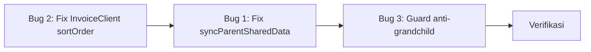

# Plan: Fix Bug Kritikal Backbone

Fokus: **3 bug kritikal** yang merusak data atau integritas struktur di production.

---

## Konteks Bisnis (Ringkas)

- **Group code = nomor Nusuk** (sistem Saudi untuk apply visa umrah). Setiap group code merepresentasikan 1 aplikasi visa terpisah.
- Satu rombongan bisa dipecah jadi **child groups** karena hotel agreement berbeda — setiap pecahan butuh nomor Nusuk sendiri.
- **Hierarki harus flat (1 level saja):** Parent → Children. Child tidak boleh punya child lagi, karena mereka semua adalah 1 rombongan yang sama.
- **Child group** mewarisi itinerary/musyrif/timeline/notes/checklist dari parent, tapi punya **VisaSetup sendiri** yang **BERBEDA** dari parent.
- Validasi agreement harus **soft** (warning di frontend), bukan strict/blocking — karena kasus di lapangan sangat beragam.

---

## Bug 1 — `syncParentSharedDataToChildrenWithPrisma` Menghapus Data Visa Child 🔴

**Dampak:** Setiap kali admin mengedit apa pun terkait visa/agreement di parent group, **semua visa data child group dihapus** dan diganti clone dari parent.

**Lokasi:** [groups-command.service.ts](file:///c:/vibe%20coding/apps/backend/src/groups/application/groups-command.service.ts) — line 1373-1439

**Dipanggil dari 7 tempat:**
- `addVisaHotelAgreementWithPrisma` (line 849)
- `updateVisaHotelAgreementWithPrisma` (line 915)
- `removeVisaHotelAgreementWithPrisma` (line 969)
- `upsertPrimaryRaudhahAppointmentWithPrisma` (line 1025)
- 3 call site lainnya untuk update group fields (line 1218, 1228, 1311)

**Yang terjadi saat dipanggil:**
```
Parent edit agreement
  → syncParentSharedDataToChildrenWithPrisma(parentId, tx)
    → tx.visaSetup.deleteMany({ where: { groupId: child.id } })   ← HAPUS semua visa child!
    → tx.visaSetup.create({ data: { ...parentVisaSetup } })       ← Ganti dengan copy parent!
```

**Fix:**

#### [MODIFY] [groups-command.service.ts](file:///c:/vibe%20coding/apps/backend/src/groups/application/groups-command.service.ts)

Refactor fungsi `syncParentSharedDataToChildrenWithPrisma` — **hapus seluruh blok yang menyentuh `VisaSetup`**. Sisakan hanya sync field operasional (`arrivalDate`, `returnDate`, `packageName`):

```diff
  private async syncParentSharedDataToChildrenWithPrisma(
    parentId: string,
    tx: Prisma.TransactionClient,
    updatedFields?: { arrivalDate?: Date; returnDate?: Date; packageName?: string }
  ): Promise<void> {
    const childGroups = await tx.group.findMany({
      where: { parentGroupId: parentId },
      select: { id: true },
    });

    if (childGroups.length === 0) {
      return;
    }

    if (updatedFields && Object.keys(updatedFields).length > 0) {
      await tx.group.updateMany({
        where: { parentGroupId: parentId },
        data: updatedFields,
      });
    }

-   const parentVisaSetup = await tx.visaSetup.findUnique({
-     where: { groupId: parentId },
-     include: {
-       hotelAgreements: true,
-       raudhahAppointments: true,
-     },
-   });
-
-   if (parentVisaSetup) {
-     for (const child of childGroups) {
-       await tx.visaSetup.deleteMany({ where: { groupId: child.id } });
-       await tx.visaSetup.create({
-         data: {
-           groupId: child.id,
-           visaStatus: parentVisaSetup.visaStatus,
-           issuedDate: parentVisaSetup.issuedDate,
-           syarikah: parentVisaSetup.syarikah,
-           paymentStatus: parentVisaSetup.paymentStatus,
-           outstandingAmount: parentVisaSetup.outstandingAmount,
-           hotelAgreements: {
-             create: parentVisaSetup.hotelAgreements.map((h) => ({
-               city: h.city,
-               hotelName: h.hotelName,
-               agreementNumber: h.agreementNumber,
-               pax: h.pax,
-               status: h.status,
-               stayStart: h.stayStart,
-               stayEnd: h.stayEnd,
-             })),
-           },
-           raudhahAppointments: {
-             create: parentVisaSetup.raudhahAppointments.map((r) => ({
-               date: r.date,
-               status: r.status,
-               tasrehPrinted: r.tasrehPrinted,
-             })),
-           },
-         },
-       });
-     }
-   } else {
-     for (const child of childGroups) {
-       await tx.visaSetup.deleteMany({ where: { groupId: child.id } });
-     }
-   }
  }
```

**Kenapa ini aman:**
- `GroupsQueryService.findOneWithPrisma` sudah BENAR — override musyrif/itinerary/timeline/notes/checklist dari parent, tapi **TIDAK** override visaSetup. Child tetap pakai visa-nya sendiri.
- Data visa child yang sudah ada di DB tetap aman setelah fix — mereka hanya tidak lagi dihapus.

---

## Bug 2 — `InvoiceClient.sortOrder` Unique Constraint 🔴

**Dampak:** Tidak bisa membuat InvoiceClient baru jika `sortOrder` bentrok (error `P2002`). Ini bisa terjadi kapan saja karena auto-increment logic di service layer tidak atomik dengan constraint di DB.

**Lokasi:** [schema.prisma](file:///c:/vibe%20coding/apps/backend/prisma/schema.prisma) — model `InvoiceClient`

**Fix:**

#### [MODIFY] [schema.prisma](file:///c:/vibe%20coding/apps/backend/prisma/schema.prisma)

```diff
model InvoiceClient {
  ...
- @@unique([sortOrder])
  @@index([name])
+ @@index([sortOrder])
}
```

Lalu buat migration:
```bash
npx prisma migrate dev --name fix_invoice_client_sort_order
```

**Kenapa ini aman:**
- `sortOrder` hanya dipakai untuk display ordering, bukan sebagai identifier
- Auto-assignment di service layer (`resolveNextClientSortOrder`) sudah cari slot kosong — unique constraint justru menghambat ini

---

## Bug 3 — Tidak Ada Guard Anti-Grandchild 🔴

**Dampak:** Child group bisa dijadikan parent oleh group lain, membuat hierarki multi-level yang tidak didukung oleh kode. `syncParentSharedData` dan `findOneWithPrisma` hanya cek 1 level — jika ada grandchild, data operasional "kakek" tidak akan terwarisi, dan sync akan rusak.

**Lokasi:** [groups-command.service.ts](file:///c:/vibe%20coding/apps/backend/src/groups/application/groups-command.service.ts) — `updateWithPrisma` (line ~1306) dan `createWithPrisma`

**Saat ini:** Tidak ada validasi apapun saat `parentGroupId` di-set.

**Fix:**

#### [MODIFY] [groups-command.service.ts](file:///c:/vibe%20coding/apps/backend/src/groups/application/groups-command.service.ts)

Tambahkan method validasi baru dan panggil di `createWithPrisma` dan `updateWithPrisma` sebelum menyimpan `parentGroupId`:

```typescript
private async validateParentGroupLink(
  parentGroupId: string,
  currentGroupId: string | null,
  tx: Prisma.TransactionClient,
): Promise<void> {
  const normalizedId = parentGroupId.trim().toUpperCase();
  const proposedParent = await tx.group.findFirst({
    where: { OR: [{ id: normalizedId }, { code: normalizedId }] },
    select: { id: true, code: true, parentGroupId: true },
  });

  if (!proposedParent) {
    throw new NotFoundException(`Group '${parentGroupId}' not found.`);
  }

  // Guard 1: Target parent tidak boleh sudah menjadi child group
  if (proposedParent.parentGroupId) {
    throw new BadRequestException(
      `Group '${proposedParent.code}' sudah menjadi child group. Tidak bisa dijadikan parent.`,
    );
  }

  // Guard 2: Group ini tidak boleh sudah punya children (jika sudah punya, dia harus jadi parent, bukan child)
  if (currentGroupId) {
    const existingChildren = await tx.group.count({
      where: { parentGroupId: currentGroupId },
    });
    if (existingChildren > 0) {
      throw new BadRequestException(
        `Group ini sudah memiliki ${existingChildren} child group. Tidak bisa dijadikan child dari group lain.`,
      );
    }
  }
}
```

Panggil di `updateWithPrisma` sebelum `tx.group.update`:
```diff
  return this.prisma.$transaction(async (tx) => {
+   if (payload.parentGroupId) {
+     await this.validateParentGroupLink(payload.parentGroupId, current.id, tx);
+   }
    const updated = await tx.group.update({ ... });
```

Dan di `createWithPrisma`:
```diff
  return this.prisma.$transaction(async (tx) => {
+   if (payload.parentGroupId) {
+     await this.validateParentGroupLink(payload.parentGroupId, null, tx);
+   }
    const created = await tx.group.create({ ... });
```

---

## Urutan Eksekusi



Bug 2 duluan (paling cepat), lalu Bug 1 (paling berbahaya), lalu Bug 3 (pencegahan).

---

## Verification Plan

### Bug 2 — InvoiceClient
1. Jalankan migration
2. Buat 2 InvoiceClient baru berturut-turut dari UI → tidak boleh ada error P2002

### Bug 1 — syncParentSharedData
1. Buat parent group dengan agreement Makkah Hotel A
2. Buat 2 child group dari parent tersebut
3. Assign agreement Hotel B ke child-1, agreement Hotel C ke child-2 via Agreement Inbox
4. Kembali ke parent group, tambah agreement Hotel D ke parent
5. **Verify:** child-1 masih punya Hotel B, child-2 masih punya Hotel C → **TIDAK berubah**

### Bug 3 — Guard anti-grandchild
1. Buat Group A (parent) dan Group B (child dari A)
2. Coba buat Group C dengan `parentGroupId = Group B` → **harus ditolak** dengan pesan error
3. Coba ubah Group A menjadi child dari Group D (padahal A sudah punya children) → **harus ditolak**

### Existing Tests
```bash
npm run test --workspace backend
```
