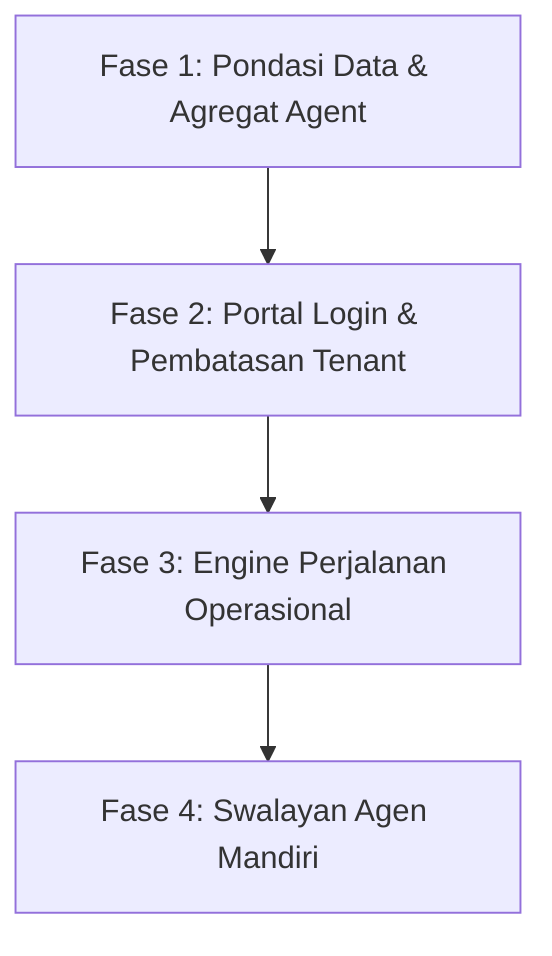

# Cetak Biru Arsitektur: Entitas Bisnis Agent & Portal Agent

Dokumen ini berfungsi sebagai acuan jangka panjang untuk mentransisikan sistem GTT dari aplikasi manajemen internal menjadi **Travel Operations Platform** yang terpadu. Arsitektur ini dirancang untuk mendukung model bisnis hibrida GTT: **B2C (Direct Umrah)** dan **B2B (Travel Operations Provider untuk Agen Mitra)** dalam satu platform tunggal.

---

## 1. Latar Belakang & Analisis Kontekstual

### Model Bisnis Hibrida GTT
GTT menjalankan dua lini bisnis utama yang berjalan secara berdampingan:

```
                         GTT (Platform)
                               │
            ┌──────────────────┴──────────────────┐
            ▼                                     ▼
      B2C Division                          B2B Division
     (Direct Retail)                  (Travel Operations Partner)
            │                                     │
    Jamaah Langsung                       Agen Travel Mitra
                                                  │
                                        Membeli Layanan:
                                        • Pengurusan Visa
                                        • Hotel Agreement
                                        • Transportasi & Raudhah
                                        • Operasional Lapangan
```

* **Model B2C:** GTT bertindak sebagai biro perjalanan umrah yang melayani jamaah retail secara langsung.
* **Model B2B:** GTT bertindak sebagai *wholesaler* atau penyedia operasional perjalanan bagi agen travel mitra. Agen-agen ini mempercayakan eksekusi lapangan (Visa, Hotel, Bus, Raudhah) kepada infrastruktur operasional GTT.

---

## 2. Permasalahan Saat Ini

1. **Ketiadaan Entitas Utama Agent:** Informasi agen saat ini masih diperlakukan sebagai metadata opsional/tambahan pada data `Group`, bukan sebagai entitas bisnis tingkat pertama (*First-Class Citizen*).
2. **Asumsi Monolitik Kepemilikan:** Sistem mengasumsikan semua rombongan (*Group*) dimiliki dan dikelola sepenuhnya secara internal oleh GTT.
3. **Keterbatasan Visibilitas Mitra:** Agen mitra tidak memiliki akses langsung untuk memantau progres keberangkatan rombongan mereka.
4. **Beban Komunikasi Manual:** Tim operasional GTT harus memberikan pembaruan status secara manual melalui WhatsApp, yang memakan waktu dan berisiko memicu ketidakakuratan data.

---

## 3. Desain Arsitektur Entitas Bisnis `Agent`

Untuk mendukung visi jangka panjang, entitas `Agent` diangkat menjadi entitas bisnis independen yang memiliki relasi struktural dengan `Group`.

### Model Agregat Agent

```
Agent (Aggregate Root)
├── Company Profile (Nama Perusahaan, Lisensi Kemenag, Alamat)
├── PIC & Contact Information (Penanggung Jawab, No. WhatsApp, Email)
├── Portal Account Credentials (Data login portal mitra)
├── Groups (Daftar rombongan yang diasosiasikan)
├── Operational Statistics (Performa pengurusan, riwayat keberangkatan)
└── Business Relationship (Kontrak kerjasama, skema harga khusus B2B)
```

### Relasi Multi-Tenancy Logis (B2B & B2C)
Model data dirancang agar sangat fleksibel dengan menambahkan kunci tamu (*foreign key*) yang bersifat *nullable* pada tabel `Group`:

```
Group
└── agent_id (UUID/Integer, Nullable)
```

* **`agent_id IS NULL`:** Menandakan grup milik divisi retail B2C GTT.
* **`agent_id = <UUID>`:** Menandakan grup milik Agen Mitra (B2B). Sistem secara otomatis menyaring hak akses dan kalkulasi biaya berdasarkan relasi ini.

---

## 4. Kebijakan Hak Akses & Multi-Tenancy

Implementasi keamanan data dilakukan secara logis pada lapisan aplikasi (*Logical Multi-Tenancy*) untuk memastikan isolasi data antar-agen:

| Peran Pengguna (Role) | Ruang Lingkup Akses data |
| :--- | :--- |
| **Internal GTT Admin** | Akses penuh (*Read/Write*) ke seluruh data Group, Agent, Transaksi Keuangan, dan Laporan Global. |
| **Agent Partner** | Akses terbatas hanya pada data Group yang memiliki `agent_id` sesuai dengan ID Agen mereka. Data agen lain diisolasi secara ketat di tingkat query (*Query Scope Filter*). |

---

## 5. Konsep Portal Agent & Visualisasi Perjalanan Operasional

Portal Agent difokuskan sebagai **layanan mandiri untuk transparansi progres operasional**, bukan alat untuk melakukan input data teknis.

### Operational Journey (Workflow Layer)
Portal Agent tidak menampilkan tabel database mentah. Sebagai gantinya, progres direpresentasikan sebagai aliran status perjalanan logis (*Operational Journey*):

```
[ Upload Paspor ] ──> [ Visa Setup ] ──> [ Hotel Agreement ] ──> [ Persetujuan Nusuk ]
                                                                        │
[ Selesai ] <── [ Penerbangan Pulang ] <── [ Madinah/Makkah ] <── [ Penerbitan Visa ]
```

* **Status Aktif (Contoh):**
  * `Menunggu Persetujuan Nusuk` (Sedang diproses di kementerian)
  * `Sedang Berada di Madinah` (Operasional perjalanan aktif)

### Dashboard Ringkasan
Halaman utama Portal Agent menyajikan indikator performa utama (*KPI*) berupa agregasi status dari semua grup mereka yang sedang berjalan:

```
[ Total Group: 12 ] ─ [ Proses Visa: 3 ] ─ [ Visa Terbit: 5 ] ─ [ Di Saudi: 4 ]
```

---

## 6. Desain Workflow Layer (Lapisan Orkestrasi)

Status perjalanan operasional (*Operational Journey*) bukan merupakan kolom statis di database. Status ini dihitung secara dinamis oleh **Workflow Engine** dari berbagai status domain penyusun:

```
                                  Workflow Engine
                                         │
        ┌──────────────┬─────────────────┼───────────────┬──────────────┐
        ▼              ▼                 ▼               ▼              ▼
   Visa State   Checklist State   Timeline State   Flight State   Invoice State
```

**Keunggulan Desain Ini:**
Jika di masa mendatang sistem menambahkan modul baru (seperti *Insurance*, *Catering*, atau *Rooming*), kita hanya perlu memperbarui logika agregasi status di dalam `Workflow Layer` tanpa perlu memodifikasi skema tabel database utama `Group`.

---

## 7. Peta Jalan Implementasi Bertahap

Evolusi menuju platform terintegrasi ini dibagi menjadi 4 fase pengembangan:



### Fase 1: Pondasi Data & Agregat Agent
* **Tindakan:** Membuat tabel database `agents`, membuat relasi `Group -> agent_id`, membangun antarmuka admin internal GTT untuk mengelola master data agen mitra.

### Fase 2: Portal Login & Pembatasan Tenant
* **Tindakan:** Membangun sub-sistem autentikasi untuk portal agen, menerapkan middleware pengamanan data berbasis `agent_id` pada query backend, serta meluncurkan dashboard ringkasan grup milik agen.

### Fase 3: Engine Perjalanan Operasional (Operational Journey)
* **Tindakan:** Membangun `Workflow Engine` untuk mengumpulkan status dari sub-domain (Visa, Invoice, Checklist, Flight) dan menerjemahkannya ke dalam bagan timeline progres di UI Agen.

### Fase 4: Swalayan Agen Mandiri (Agent Self-Service)
* **Tindakan:** Mengaktifkan fitur bagi agen untuk mengunduh dokumen visa secara mandiri, melihat detail transaksi keuangan mereka, dan mengaktifkan notifikasi webhook/WhatsApp otomatis saat terjadi perubahan status penting pada grup mereka.
