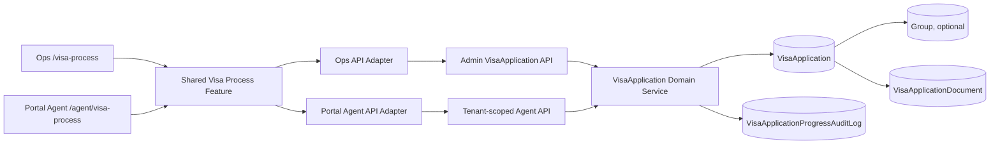

# Ops & Portal Agent — Visa Process End-to-End Plan

Status: **Frontend Visa Process superseded by Portal Agent Visa Tracking**  
Tanggal: **19 Juli 2026**  
Scope dokumen: **rencana end-to-end beserta catatan eksekusi lokal**

## 0. Catatan Eksekusi

### Keputusan lanjutan 19 Juli 2026

- UI, menu, dan route Visa Process di Ops maupun Portal Agent dihapus.
- Model, migration, fixture, audit, dan API `VisaApplication` tetap dipertahankan untuk menjaga data serta kemungkinan kebutuhan backend berikutnya.
- Visa Tracking Ops tidak diubah.
- Portal Agent menggunakan route `/agent/visa` dan detail `/agent/visa/:identity`.
- Tombol View pada Visa Tracking Portal Agent membuka detail visa external-friendly, bukan Group Detail.
- Halaman dan menu My Groups dihapus karena fungsinya sudah tersedia pada Overview. Group Detail tetap dapat dibuka dari kartu Group di Overview.
- Halaman, menu, route, dan kode frontend Invoice serta Agreement dihapus dari Portal Agent. Modul Invoice dan Agreement pada Ops serta API backend tetap dipertahankan.
- Visa Tracking Ops dan Portal Agent menampilkan total visa Issued untuk bulan yang dipilih dan seluruh periode berdasarkan `issuedDate`. Tanggal keberangkatan tidak lagi dipakai sebagai fallback; record Issued tanpa tanggal ditandai sebagai data tidak lengkap.

### Riwayat implementasi awal (superseded)

Catatan di bawah merekam implementasi Visa Process sebelumnya. Untuk perilaku frontend aktif, keputusan lanjutan di atas menjadi acuan dan menggantikan route maupun UI yang disebutkan di bagian riwayat ini.

Plan awal dieksekusi pada 19 Juli 2026 dengan hasil utama:

- `apps/agent-portal` generated-only telah dihapus dan di-ignore;
- area internal diberi nama **Ops**, sedangkan area `/agent/*` diberi nama **Portal Agent**;
- route Ops `/visa-process` ditambahkan tanpa mengganti `/visa` Visa Tracking;
- Ops mendapat worklist, filter, detail lima facet, update progres, linking Group, warning mismatch, dan audit;
- Portal Agent memakai feature presentasi yang sama dalam mode read-only dan tenant-scoped;
- relasi opsional unique `VisaApplication.groupId`, audit progres, dan index monitoring telah dimigrasikan;
- response Portal Agent tidak menyertakan `adminNote`, actor audit, creator ID, storage key dokumen, atau Group note internal;
- fixture development `480900308615` ditautkan ke Group JSA canonical dan diuji idempotent dua kali;
- exact legacy fixture `GTT-VA-20260718-9FF7DFA2` dibersihkan pada database development;
- backend/frontend typecheck, build, unit test, component test, dan API integration test lulus;
- browser E2E untuk login, overview, navigasi utama, lazy route, profile/modal, dan user management lulus. Empat journey lama di luar Visa Process masih gagal karena validasi form Group dan locator Payment lama yang sudah berubah pada worktree aktif; hasil ini dicatat sebagai regression baseline terpisah, bukan disembunyikan.

Migration bersifat additive. Rollback aplikasi mengikuti Bagian 24: rollback bundle/kode terlebih dahulu dan pertahankan kolom serta audit table agar data tidak hilang.

## 1. Ringkasan Eksekutif

Project akan menggunakan satu frontend production, yaitu `apps/frontend`, dengan dua area produk yang jelas:

- **Ops** untuk pengguna internal dengan role Admin atau Super Admin.
- **Portal Agent** untuk pengguna eksternal yang terikat pada satu Agent.

Direktori aplikasi lama `apps/agent-portal` akan dihapus. Direktori tersebut saat ini hanya berisi artefak lokal berupa `dist`, cache Vite, dan hasil test; tidak ada source aktif yang tercatat Git. Source Portal Agent yang digunakan tetap berada dalam frontend utama.

Ops akan mendapatkan halaman baru **Visa Process** untuk melihat seluruh pengajuan visa, memprioritaskan pengajuan yang belum selesai, dan mengubah status pada lima bagian proses yang benar-benar tersedia di database. Portal Agent menggunakan presentasi data yang sama dalam mode read-only dan hanya dapat melihat data milik Agent-nya sendiri.

Halaman `Visa Tracking` yang sudah ada tidak dihapus pada fase ini. Fungsinya tetap sebagai monitoring operasional visa berbasis `Group`/`VisaSetup`, sedangkan halaman baru `Visa Process` menggunakan `VisaApplication` sebagai sumber data pengajuan dan progres proses.

Data development tidak akan menggunakan nomor seperti `DEMO-VA-001`. Identitas yang terlihat pengguna mengikuti pola numerik operasional yang ditemukan pada database aktif, yaitu mayoritas `480900xxxxxx`. Fixture utama akan menggunakan Group JSA `480900308615` dan akan dihubungkan secara eksplisit melalui `groupId`, bukan hanya dibuat terlihat mirip melalui string.

## 2. Keputusan Produk yang Dikunci

Keputusan berikut menjadi baseline implementasi:

1. Nama dashboard internal adalah **Ops**.
2. Nama dashboard eksternal adalah **Portal Agent**.
3. `Admin` dan `Super Admin` tetap merupakan nama role, bukan nama produk.
4. Hanya ada satu frontend production: `apps/frontend`.
5. Route teknis Portal Agent tetap berada di bawah `/agent/*` untuk menjaga kompatibilitas session dan API.
6. Route baru Ops untuk proses pengajuan visa adalah `/visa-process`.
7. Route lama `/visa` tetap menjadi **Visa Tracking**.
8. Ops dapat mengubah progres `VisaApplication`.
9. Portal Agent bersifat read-only terhadap progres bisnis.
10. Lima facet database adalah sumber kebenaran untuk tampilan proses.
11. `VisaApplication.status` adalah status turunan dan tidak diedit langsung dari UI.
12. Tidak ada PIC, ETA, SLA, blocker, atau requirement dokumen yang ditampilkan bila datanya tidak tersimpan.
13. Satu Group maksimal mempunyai satu VisaApplication pada MVP.
14. VisaApplication boleh belum terhubung ke Group.
15. Data fixture development menggunakan identitas numerik yang konsisten dengan data Group.
16. Tidak ada seed demo yang berjalan di production.
17. Tidak ada form pengajuan visa baru dalam scope ini; scope utama adalah monitoring, linking, dan perubahan progres.

## 3. Baseline Repository dan Temuan Aktual

### 3.1 Struktur aplikasi

Kondisi saat dokumen dibuat:

- `apps/frontend` adalah React SPA aktif.
- Portal Agent aktif berada di `apps/frontend/src/agent`.
- `apps/agent-portal` adalah direktori untracked yang hanya berisi artefak build/test.
- Routing utama memilih area internal atau Portal Agent berdasarkan prefix `/agent`.
- Backend NestJS dan Prisma digunakan bersama oleh Ops dan Portal Agent.

Implikasi:

- `apps/agent-portal` dapat dibuang tanpa memigrasikan source darinya.
- `apps/frontend/src/agent` tidak boleh ikut dihapus karena merupakan source Portal Agent yang aktif.
- Komponen Visa Process perlu dipindahkan dari folder khusus Agent ke feature bersama agar dapat digunakan Ops dan Portal Agent tanpa duplikasi.

### 3.2 Visa Tracking internal saat ini

Halaman internal `/visa`:

- dibangun dari data `Group`;
- menggunakan struktur `VisaSetup`, hotel agreement, payment, syarikah, dan Raudhah;
- berfungsi sebagai control board berbasis Group;
- belum membaca `VisaApplication`;
- tidak memberikan daftar khusus pengajuan visa yang belum selesai.

Halaman ini tetap berguna dan tidak diganti pada fase ini.

### 3.3 Visa Process Portal Agent saat ini

Halaman `/agent/visa-process`:

- membaca `GET /api/agent/visa-applications`;
- sudah tenant-scoped oleh principal Agent;
- bersifat read-only;
- menampilkan delapan node visual;
- menyimpulkan delapan node tersebut dari hanya lima facet database;
- membuat teks responsible team dan ETA di frontend;
- menganggap empat tipe dokumen sebagai required tanpa model requirement tersendiri;
- menghitung progress secara linear walaupun Agreement dan Nusuk dapat berjalan paralel.

Presentasi ini perlu disederhanakan agar sesuai fakta yang tersedia.

### 3.4 API VisaApplication saat ini

Endpoint internal yang sudah ada:

- `GET /api/visa-applications`
- `PATCH /api/visa-applications/:id/progress`

Endpoint Portal Agent yang sudah ada:

- `GET /api/agent/visa-applications`
- `GET /api/agent/visa-applications/:id`

Kekurangan utama:

- belum ada detail endpoint khusus Admin;
- belum ada filter/pagination internal;
- belum ada endpoint linking Group;
- belum ada audit log perubahan progres;
- belum ada creation endpoint yang memakai `CreateVisaApplicationDto`;
- `submittedAt` belum dikelola oleh update progress;
- `completedAt` tidak dikosongkan ketika proses dibuka kembali;
- belum ada relasi `VisaApplication.groupId`.

### 3.5 Pola nomor aktual

Database aktif saat audit memiliki 40 Group:

- 39 Group menggunakan kode 12 digit dengan prefix `480900`;
- 1 Group legacy menggunakan kode `2026`;
- tidak ditemukan Group aktif dengan nomor `DEMO-*`;
- tidak ditemukan Group aktif literal `490xxxxx`;
- maksud pola numerik operasional tetap valid, tetapi implementasi harus mengikuti nilai aktual `480900xxxxxx`.

Group JSA yang tersedia:

| Group code | Group name | Pax | Package | Arrival | Return |
| --- | --- | ---: | --- | --- | --- |
| `480900070470` | VISA ONLY KEB 22 JUNI 1 PAX JSA VINA | 1 | PRIVATE | 2026-06-22 | 2026-06-30 |
| `480900151817` | VISA ONLY KEB 9 JULI 2 PAX JSA ROMI | 2 | PRIVATE | 2026-07-09 | 2026-07-22 |
| `480900308615` | VISA ONLY KEB 3 AGUSTUS 11 PAX JSA | 11 | PRIVATE | 2026-08-03 | 2026-08-11 |

VisaApplication JSA yang tersedia saat audit:

| Field | Value |
| --- | --- |
| applicationNumber | `GTT-VA-20260718-9FF7DFA2` |
| agent | JSA |
| departureDate | 2026-08-11 |
| returnDate | 2026-08-18 |
| packageName | Umrah 7 Hari Smart |
| passengerCount | 35 |
| documentStatus | WAITING_DOCUMENT |
| facet lain | NOT_STARTED |

Record tersebut tidak cocok dengan satu pun Group JSA. Karena dianggap data development/dummy dalam konteks rencana ini, record tersebut akan dinormalisasi hanya melalui mekanisme seed development yang eksplisit. Tidak ada migrasi production yang mengubahnya secara otomatis.

## 4. Target Arsitektur



Prinsip arsitektur:

- data domain dan status mapping dibagikan;
- query adapter tetap dipisahkan berdasarkan boundary authentication;
- Portal Agent tidak pernah memakai endpoint internal;
- Ops tidak menyamar sebagai Agent untuk membaca data;
- backend tetap menjadi enforcement boundary untuk tenant dan role;
- UI hanya menentukan capability berdasarkan principal, bukan keamanan final.

## 5. Terminologi dan Branding

### 5.1 Nama yang terlihat pengguna

| Konteks | Nama |
| --- | --- |
| Produk internal | Ops |
| Produk eksternal | Portal Agent |
| Role internal | Admin / Super Admin |
| Pengguna eksternal | Agent |
| Fitur pengajuan | Visa Process |
| Fitur group-centric lama | Visa Tracking |

### 5.2 Area copy yang harus disesuaikan

Ops:

- halaman login internal;
- restoring-session screen;
- sidebar/header;
- profile copy;
- document title;
- error/empty state;
- README dan application overview.

Portal Agent:

- halaman login Agent;
- loading/error session;
- sidebar dan mobile navigation;
- page title;
- group detail branding;
- logout copy;
- dokumentasi operasional.

### 5.3 Nama teknis yang tetap dipertahankan

Nama berikut tidak perlu diganti dalam fase ini:

- route `/agent/*`;
- endpoint `/api/agent/*`;
- cookie `gtt_agent_session`;
- model `Agent`, `AgentPortalUser`, dan `AgentPrincipal`;
- folder `apps/frontend/src/agent` untuk shell/auth yang masih khusus Agent.

Penggantian nama teknis tersebut berisiko memperluas scope tanpa manfaat produk langsung.

## 6. Definisi Produk Visa Process

### 6.1 Pertanyaan yang harus dijawab halaman

Untuk Ops:

1. Pengajuan mana yang belum selesai?
2. Pengajuan mana yang perlu revisi?
3. Pengajuan milik Agent mana?
4. Status faktual setiap bagian proses apa?
5. Data Nusuk apa yang sudah tersedia?
6. Kapan record terakhir diperbarui?
7. Apakah pengajuan sudah terhubung ke Group?
8. Perubahan apa yang terakhir dilakukan dan oleh siapa?

Untuk Portal Agent:

1. Pengajuan milik Agent ini apa saja?
2. Bagian proses mana yang sudah selesai?
3. Apakah dokumen perlu direvisi?
4. Apakah nomor/referensi Nusuk sudah tersedia?
5. Apakah visa sudah submitted, processing, issued, atau completed?
6. Kapan status terakhir diperbarui?

### 6.2 Lima facet canonical

| UI section | Database field | Allowed values | Terminal value |
| --- | --- | --- | --- |
| Dokumen | `documentStatus` | WAITING_DOCUMENT, NEED_REVISION, VERIFIED | VERIFIED |
| Hotel Agreement | `agreementStatus` | NOT_STARTED, WAITING_APPROVAL, APPROVED | APPROVED |
| Nusuk | `nusukStatus` | NOT_STARTED, PASSENGER_ENTRY, PASSENGER_ENTERED, GROUP_CREATED | GROUP_CREATED |
| Pembayaran | `paymentStatus` | NOT_STARTED, WAITING_PAYMENT, COMPLETED | COMPLETED |
| Visa | `visaStatus` | NOT_STARTED, READY_TO_SEND, SUBMITTED, PROCESSING, ISSUED, COMPLETED | COMPLETED |

`VisaApplication.status` tetap diturunkan backend dari kombinasi facet.

### 6.3 Presentation rule

UI tidak lagi menampilkan workflow delapan langkah yang terlihat independen. Sebagai gantinya:

- tampilkan lima kartu/section status;
- tampilkan enum yang sudah diterjemahkan ke label manusia;
- tampilkan `Ready to Send` sebagai derived badge bila dokumen verified, agreement approved, dan Nusuk group created;
- tampilkan `Visa Issued` saat `visaStatus` ISSUED atau COMPLETED;
- tampilkan `Process Completed` hanya saat overall status COMPLETED;
- jangan menyatakan progress 100% hanya karena visa issued bila payment atau completion belum selesai;
- gunakan ringkasan `x dari 5 bagian selesai` bila progress numerik tetap dibutuhkan;
- jangan membuat jalur linear palsu untuk Agreement dan Nusuk.

### 6.4 Kategori worklist

Kategori daftar Ops ditentukan secara faktual:

- **Belum Selesai**: overall status bukan COMPLETED.
- **Perlu Revisi**: documentStatus adalah NEED_REVISION.
- **Sedang Berjalan**: belum selesai dan bukan NEED_REVISION.
- **Visa Terbit**: visaStatus ISSUED atau COMPLETED.
- **Selesai**: overall status COMPLETED.

Tidak ada kategori `Overdue`, `SLA Breach`, atau `Blocked` sampai timestamp/SLA/issue domain tersedia.

## 7. Perubahan Model Data

### 7.1 Optional Group relation

Tambahkan relasi opsional dan unique untuk MVP:

```prisma
model VisaApplication {
  id                    String  @id @default(cuid())
  applicationNumber     String  @unique
  agentId               String
  groupId               String? @unique
  createdByPortalUserId String

  group Group? @relation(fields: [groupId], references: [id], onDelete: SetNull)

  @@index([agentId, updatedAt(sort: Desc)])
  @@index([status, updatedAt(sort: Desc)])
}

model Group {
  visaApplication VisaApplication?
}
```

Alasan `groupId` opsional:

- pengajuan dapat ada sebelum Group terbentuk;
- data yang sudah mempunyai Group dapat memakai identity operasional sebenarnya;
- link tidak bergantung pada nama bebas;
- penghapusan Group tidak menghapus histori VisaApplication;
- satu Group satu VisaApplication cukup untuk MVP.

### 7.2 Invariant linking

Saat link dibuat:

1. VisaApplication harus ada.
2. Group harus ada.
3. Group belum dipakai VisaApplication lain.
4. `VisaApplication.agentId` harus sama dengan `Group.agentId`.
5. Agent harus berstatus ACTIVE.
6. Link dilakukan berdasarkan internal `groupId`, bukan group name.
7. Aksi dicatat pada audit log.

Tidak ada auto-link berdasarkan:

- kemiripan nama;
- pax yang sama;
- tanggal yang dekat;
- package name;
- nomor yang hanya terlihat mirip.

### 7.3 Audit progres

Tambahkan audit model minimal:

```prisma
model VisaApplicationProgressAuditLog {
  id                String   @id @default(cuid())
  visaApplicationId String
  actorAuthUserId   String
  action            String
  changes           Json
  createdAt         DateTime @default(now())

  visaApplication VisaApplication @relation(fields: [visaApplicationId], references: [id], onDelete: Cascade)
  actorAuthUser   AuthUser         @relation(fields: [actorAuthUserId], references: [id], onDelete: Restrict)

  @@index([visaApplicationId, createdAt(sort: Desc)])
  @@index([actorAuthUserId, createdAt(sort: Desc)])
}
```

`changes` menyimpan hanya field yang berubah dengan bentuk before/after. Password, cookie, token, dan request header tidak boleh masuk audit.

### 7.4 Timestamp semantics

- `submittedAt` diisi saat pertama kali visaStatus memasuki SUBMITTED atau status setelahnya.
- `submittedAt` tidak ditimpa pada update berikutnya.
- `completedAt` diisi saat overall status menjadi COMPLETED.
- `completedAt` dikosongkan bila proses dibuka kembali.
- `updatedAt` tetap dikelola Prisma.
- timestamp tidak dibuat dari data backfill bila evidence waktu tidak tersedia.

## 8. Kebijakan Nomor dan Identitas

### 8.1 Identitas yang ditampilkan

Urutan prioritas display:

1. Bila terhubung, tampilkan `group.code` sebagai nomor utama.
2. Tampilkan `group.name` sebagai nama utama.
3. `applicationNumber` dapat tampil sebagai reference sekunder bila berbeda.
4. Bila belum terhubung, gunakan `applicationNumber` sebagai nomor utama.

### 8.2 Format numerik

Baseline data aktif adalah `480900xxxxxx`. Karena terdapat legacy code `2026`, fase ini tidak menambahkan regex global yang akan menolak data lama.

Aturan MVP:

- fixture dan record baru yang terlihat pengguna menggunakan nomor numerik;
- tidak ada prefix `DEMO`, `TEST`, atau `GTT-VA` pada fixture baru;
- uniqueness tetap ditegakkan database;
- input ditrim;
- tidak mengubah nomor production secara otomatis;
- aturan generator nomor production ditunda sampai sumber sequence bisnis dipastikan.

### 8.3 Linked versus unlinked application

Linked application:

- group code/name/agent/date/pax/package dibaca dari Group sebagai canonical display;
- field VisaApplication yang duplikatif diperlakukan sebagai submission snapshot/fallback;
- mismatch dapat ditampilkan kepada Ops sebagai data warning;
- Portal Agent hanya melihat canonical display, bukan konflik internal.

Unlinked application:

- menggunakan applicationNumber;
- menggunakan departure/return date, package, pax, dan Agent dari VisaApplication;
- menampilkan state `Belum terhubung ke Group` kepada Ops;
- Portal Agent tetap dapat melihat application miliknya selama tenant scope valid.

## 9. Source-of-Truth Matrix

| Informasi | Linked application | Unlinked application |
| --- | --- | --- |
| Nomor utama | Group.code | VisaApplication.applicationNumber |
| Nama | Group.name | Package/application label |
| Agent | Group.agent | VisaApplication.agent |
| Departure/return | Group arrival/return | VisaApplication departure/return |
| Pax | Group.pax | VisaApplication.passengerCount |
| Package | Group.packageName | VisaApplication.packageName |
| Departure city | VisaApplication.departureCity | VisaApplication.departureCity |
| Provider | VisaApplication.providerName | VisaApplication.providerName |
| Document status | VisaApplication.documentStatus | VisaApplication.documentStatus |
| Agreement status | VisaApplication.agreementStatus | VisaApplication.agreementStatus |
| Nusuk status | VisaApplication.nusukStatus | VisaApplication.nusukStatus |
| Payment status | VisaApplication.paymentStatus | VisaApplication.paymentStatus |
| Visa status | VisaApplication.visaStatus | VisaApplication.visaStatus |
| Notes | VisaApplication.adminNote | VisaApplication.adminNote |

UI tidak boleh melakukan pencampuran diam-diam di luar matrix ini.

## 10. Backend Domain Plan

### 10.1 Extract status derivation

Pindahkan `deriveStatus` menjadi domain function yang dapat diuji tanpa Prisma, misalnya:

```text
visa-applications/domain/derive-visa-application-status.ts
```

Input function adalah lima facet. Output adalah `VisaApplicationStatus`.

Semua jalur update menggunakan function yang sama:

- Admin progress mutation;
- backfill;
- seed verification;
- reconciliation test.

### 10.2 Update transaction

`PATCH /api/visa-applications/:id/progress` berjalan dalam satu transaction:

1. Ambil record saat ini.
2. Gabungkan facet yang dikirim dengan nilai saat ini.
3. Hitung overall status baru.
4. Hitung perubahan timestamp.
5. Update VisaApplication.
6. Buat audit log dengan actor internal.
7. Kembalikan normalized projection.

Jika audit insert gagal, update status juga harus rollback.

### 10.3 Transition policy MVP

UI hanya menawarkan enum valid. Backend tetap menerima update facet parsial.

Fase ini tidak mengarang dependency bisnis baru seperti:

- payment harus selalu selesai sebelum submission;
- agreement harus selalu selesai sebelum passenger entry;
- visa issued otomatis berarti completed.

Dependency tersebut memerlukan keputusan bisnis tertulis. Backend hanya menjaga:

- nilai enum valid;
- overall status konsisten;
- timestamp konsisten;
- link Group konsisten;
- tenant dan role aman.

### 10.4 Document policy

`VisaApplicationDocument` yang ada ditampilkan berdasarkan row aktual.

MVP tidak boleh:

- menyebut semua empat document type wajib;
- menghitung missing documents dari daftar hard-coded;
- membuat document placeholder di response;
- menyatakan verified jika row dokumen tidak mendukung.

Aggregate `documentStatus` tetap menjadi status section Dokumen. Review per dokumen berada di luar scope sampai tersedia endpoint review yang jelas.

## 11. API Contract Plan

### 11.1 Ops list

```http
GET /api/visa-applications?q=&agentId=&view=incomplete&page=1&pageSize=20
```

Allowed view:

- `all`
- `incomplete`
- `revision`
- `in-progress`
- `issued`
- `completed`

Response target:

```json
{
  "items": [],
  "meta": {
    "page": 1,
    "pageSize": 20,
    "total": 0,
    "totalPages": 1
  },
  "summary": {
    "incomplete": 0,
    "revision": 0,
    "inProgress": 0,
    "issued": 0,
    "completed": 0
  }
}
```

Default server ordering:

1. NEED_REVISION;
2. incomplete paling lama tidak di-update;
3. completed paling baru.

### 11.2 Ops detail

```http
GET /api/visa-applications/:id
```

Response menyertakan:

- normalized identity;
- raw facet statuses;
- overall status;
- actual documents;
- Nusuk numbers;
- adminNote;
- submitted/completed timestamps;
- Group relation;
- dataWarnings untuk Ops;
- audit entries terbatas.

### 11.3 Ops progress update

```http
PATCH /api/visa-applications/:id/progress
Content-Type: application/json
```

Payload tetap parsial:

```json
{
  "documentStatus": "VERIFIED",
  "adminNote": null
}
```

Hanya field yang dikirim yang diubah.

### 11.4 Ops Group linking

```http
PATCH /api/visa-applications/:id/group
Content-Type: application/json

{
  "groupId": "group-cuid"
}
```

Unlink, bila diperlukan:

```json
{
  "groupId": null
}
```

Unlink memerlukan konfirmasi UI dan audit log.

### 11.5 Portal Agent endpoints

Pertahankan:

```http
GET /api/agent/visa-applications
GET /api/agent/visa-applications/:id
```

Aturan:

- tidak menerima `agentId` dari query/header/body;
- scope selalu berasal dari authenticated AgentPrincipal;
- response tidak menyertakan internal dataWarnings atau audit actor;
- `adminNote` hanya ditampilkan bila diputuskan sebagai catatan publik; untuk MVP gunakan copy yang aman atau sembunyikan field internal.

Karena model saat ini hanya mempunyai `adminNote`, implementasi perlu menetapkan salah satu:

- `adminNote` sepenuhnya internal dan tidak dikirim ke Portal Agent; atau
- rename/add `publicNote` bila Agent perlu menerima alasan revisi.

Default aman untuk implementasi awal: **adminNote internal, Portal Agent hanya menerima reviewNote dokumen yang memang ditujukan untuk revisi**.

## 12. Shared Frontend Feature

### 12.1 Target folder

```text
apps/frontend/src/features/visa-process/
├── api/
│   ├── ops-visa-process-api.ts
│   └── portal-agent-visa-process-api.ts
├── components/
│   ├── visa-process-metrics.tsx
│   ├── visa-process-filters.tsx
│   ├── visa-process-worklist.tsx
│   ├── visa-process-worklist-card.tsx
│   ├── visa-process-workspace.tsx
│   ├── visa-process-section-card.tsx
│   ├── visa-process-document-list.tsx
│   └── visa-process-edit-panel.tsx
├── domain/
│   ├── visa-process-status.ts
│   ├── visa-process-progress.ts
│   └── visa-process-view.ts
├── queries/
│   ├── ops-visa-process-query.ts
│   └── portal-agent-visa-process-query.ts
├── contracts.ts
└── index.ts
```

### 12.2 Capability model

Shared component tidak menerima boolean yang tersebar. Gunakan capability object:

```ts
type VisaProcessCapabilities = {
  canUpdateProgress: boolean;
  canLinkGroup: boolean;
  canViewInternalNote: boolean;
  canViewAudit: boolean;
};
```

Ops:

```ts
{
  canUpdateProgress: true,
  canLinkGroup: true,
  canViewInternalNote: true,
  canViewAudit: true
}
```

Portal Agent:

```ts
{
  canUpdateProgress: false,
  canLinkGroup: false,
  canViewInternalNote: false,
  canViewAudit: false
}
```

### 12.3 Shared versus specific responsibility

Shared:

- status labels dan tone;
- lima section cards;
- normalized identity display;
- documents display;
- loading/error/empty/partial state;
- responsive worklist/workspace layout;
- accessibility behavior.

Ops-specific:

- all-agent query;
- Agent filter;
- progress editing;
- Group linking;
- internal note;
- audit preview.

Portal-specific:

- tenant-scoped query keys;
- session boundary;
- read-only indicator;
- public-safe copy.

## 13. Halaman Ops Visa Process

### 13.1 Route dan navigation

Tambahkan canonical route:

```text
/visa-process
/visa-process/:id
```

Sidebar Ops:

- Overview
- H-1 Checklist
- Visa Tracking
- **Visa Process**
- Agreement Inbox
- Invoice
- administrative tools sesuai role.

Mobile navigation tidak perlu menambah tombol permanen bila ruang tidak cukup. Visa Process dapat ditempatkan pada quick actions/tools sheet.

### 13.2 Layout desktop

Urutan halaman:

1. Header dan pencarian.
2. Hero `Visa Process` dengan deskripsi singkat.
3. Metric cards.
4. Filter bar.
5. Split workspace:
   - worklist di kiri;
   - detail/edit workspace di kanan.
6. Pagination.

Metric cards:

- Belum Selesai.
- Perlu Revisi.
- Sedang Berjalan.
- Visa Terbit.
- Selesai dapat tampil sebagai secondary metric bila ruang cukup.

### 13.3 Filter Ops

- search number/name/package/departure city;
- view status;
- Agent;
- departure month;
- linked/unlinked Group;
- sort last updated.

Filter tidak boleh bergantung pada field yang tidak tersedia.

### 13.4 Worklist card

Setiap card menampilkan:

- nomor Group atau applicationNumber;
- Group name bila terhubung;
- Agent name;
- package;
- pax;
- departure date;
- overall status;
- last updated;
- factual attention indicator hanya jika NEED_REVISION.

Tidak menampilkan ETA atau assigned PIC.

### 13.5 Detail workspace

Bagian identity:

- nomor utama;
- nama Group;
- Agent;
- package;
- pax;
- departure/return date;
- departure city;
- linked/unlinked badge;
- provider bila tersedia.

Bagian progress:

- Dokumen;
- Hotel Agreement;
- Nusuk;
- Pembayaran;
- Visa.

Bagian supporting data:

- actual document rows;
- Nusuk group number;
- Nusuk reference number;
- submittedAt;
- completedAt;
- internal note;
- recent audit entries.

### 13.6 Edit interaction

- setiap section mempunyai tombol `Ubah Status`;
- editor menggunakan enum options dari contract;
- mutation hanya mengirim field section tersebut;
- tombol disabled selama request;
- tampilkan inline validation error;
- sukses menutup editor dan refresh query;
- perubahan mundur dari completed membutuhkan konfirmasi;
- overall status tidak mempunyai dropdown.

Group linking menggunakan dialog terpisah dan hanya menampilkan Group dari Agent yang sama.

## 14. Halaman Portal Agent Visa Process

### 14.1 Route

Pertahankan:

```text
/agent/visa-process
```

Detail dapat tetap berada pada workspace yang sama atau memakai:

```text
/agent/visa-process/:id
```

Deep link detail direkomendasikan agar refresh dan sharing internal Agent stabil.

### 14.2 Tampilan

Portal Agent menggunakan komponen identity, status section, dan document list yang sama dengan Ops.

Perbedaan:

- tidak ada tombol edit;
- tidak ada Agent filter;
- tidak ada Group linking;
- tidak ada internal note;
- tidak ada audit actor;
- ada Read Only indicator;
- copy menggunakan `Portal Agent` secara konsisten.

### 14.3 Informasi revisi

Portal Agent hanya menerima alasan revisi yang memang public-safe:

- document `reviewNote`; atau
- field public note yang ditambahkan secara eksplisit.

Jangan mengirim `adminNote` internal secara default.

### 14.4 Empty state

Jika tidak ada pengajuan:

- jangan membuat dummy di frontend;
- tampilkan `Belum ada pengajuan visa`;
- jelaskan bahwa data akan muncul setelah pengajuan dicatat;
- jangan menampilkan tombol create karena creation flow di luar scope.

## 15. Rencana Data Development dan Seed

### 15.1 Prinsip

- tidak ada nomor `DEMO-*` yang terlihat pengguna;
- tidak ada array dummy di komponen React;
- fixture hanya hidup pada database development/test;
- production menolak seed;
- fixture menggunakan relasi database valid;
- field yang tidak diketahui tetap `null`;
- tidak membuat data hanya untuk mengisi metric card.

### 15.2 Fixture utama

Gunakan satu fixture utama berbasis Group JSA aktual:

| VisaApplication field | Source/value |
| --- | --- |
| internal fixture key | `seed_visa_application_jsa_august` |
| applicationNumber | `480900308615` |
| groupId | ID Group dengan code `480900308615` |
| agentId | Group.agentId, wajib JSA |
| createdByPortalUserId | Portal User aktif untuk JSA |
| departureDate | 2026-08-03 dari Group |
| returnDate | 2026-08-11 dari Group |
| departureCity | Jakarta, berasal dari VisaApplication development yang sudah ada |
| providerName | null |
| packageName | PRIVATE dari Group |
| passengerCount | 11 dari Group |
| status | WAITING_DOCUMENT, derived |
| documentStatus | WAITING_DOCUMENT |
| agreementStatus | NOT_STARTED |
| nusukStatus | NOT_STARTED |
| paymentStatus | NOT_STARTED |
| visaStatus | NOT_STARTED |
| nusukGroupNumber | null |
| nusukReferenceNumber | null |
| adminNote | null |
| submittedAt | null |
| completedAt | null |
| documents | none |

### 15.3 Mengapa hanya satu fixture database

Satu fixture cukup untuk memastikan:

- Portal Agent memiliki data nyata untuk dibaca;
- Ops memiliki record belum selesai untuk dimonitor;
- relasi Group/Agent dapat diuji;
- UI empty/partial state tetap realistis.

Variasi status tidak perlu dimasukkan ke database pengguna. Skenario tersebut dibuat sebagai unit/component/integration test fixtures.

### 15.4 Test-only fixtures

Test boleh memakai nomor:

- `480900900001`
- `480900900002`
- `480900900003`

Nomor tersebut:

- hanya dibuat dalam transaction/database test;
- dibersihkan setelah test;
- tidak masuk seed development default;
- tidak tampil pada dashboard pengguna setelah test.

Skenario test:

1. WAITING_DOCUMENT.
2. NEED_REVISION.
3. DOCUMENT_VERIFIED.
4. WAITING_APPROVAL.
5. PASSENGER_ENTRY.
6. GROUP_CREATED.
7. WAITING_PAYMENT.
8. SUBMITTED.
9. PROCESSING.
10. ISSUED.
11. COMPLETED.

### 15.5 Seed flag

Tambahkan flag eksplisit:

```text
SEED_VISA_APPLICATION_FIXTURES=true
```

Behavior:

- flag false/absent: fixture VisaApplication dilewati;
- development + true: fixture di-upsert;
- production + true: proses ditolak;
- missing JSA Group/Portal User: seed gagal dengan pesan actionable;
- existing non-fixture application: tidak disentuh.

### 15.6 Idempotency

Seed mencari fixture berdasarkan stable identity dan applicationNumber.

Setiap run:

- tidak membuat row kedua;
- tidak menduplikasi dokumen;
- tidak mengubah data non-fixture;
- menyinkronkan identity fixture dengan Group canonical;
- menulis log singkat tanpa password/hash/token.

### 15.7 Penanganan dummy lama

Record `GTT-VA-20260718-9FF7DFA2`:

- tidak diubah oleh migration schema;
- tidak dicari berdasarkan pattern umum `GTT-VA-*`;
- hanya dapat dinormalisasi/dihapus dalam development bila exact fixture identity cocok dan flag seed/reset aktif;
- production data dengan format lama tetap dipertahankan;
- operasi cleanup dicatat di output seed.

### 15.8 Reset ordering

Perbarui `resetData()` agar foreign key aman:

1. VisaApplicationProgressAuditLog.
2. VisaApplicationDocument.
3. VisaApplication.
4. AgentPortalAccountAuditLog.
5. AgentPortalUser.
6. Domain child rows lain.
7. Group.
8. Agent.

`SEED_RESET=true` tetap merupakan operasi eksplisit dan development-only.

## 16. Cleanup `apps/agent-portal`

### 16.1 Pre-delete verification

Sebelum menghapus:

- pastikan direktori tetap untracked;
- pastikan hanya berisi `dist`, `node_modules`, dan `test-results`;
- jalankan pencarian referensi pada package scripts, Docker, CI, deploy, dan docs;
- pastikan build Portal Agent berasal dari `apps/frontend`.

### 16.2 Cleanup action

- hapus `apps/agent-portal` seluruhnya;
- tambahkan ignore yang mencegah artefak retired app muncul kembali;
- generalisasikan ignore test-results bila tepat;
- jangan menghapus `apps/frontend/src/agent`;
- jangan menghapus backend module `agent-auth` atau `agent-portal-read`.

### 16.3 Documentation

Dokumentasi aktif harus menyatakan:

- satu frontend;
- dua product area;
- `/agent` adalah route Portal Agent;
- `apps/agent-portal` retired;
- roadmap lama ditandai superseded bila bertentangan.

Dokumen archive boleh mempertahankan referensi historis.

## 17. Security dan Authorization

### 17.1 Ops

- Admin dan Super Admin dapat read/update Visa Process.
- Auth guard internal tetap wajib.
- Role enforcement dilakukan backend.
- Actor untuk audit berasal dari session internal, bukan payload.

### 17.2 Portal Agent

- scope berasal dari `AgentPrincipal.agentId`;
- route menolak tenant selector dari query/header/body;
- detail menggunakan `findFirst({ id, agentId })` atau equivalent;
- Portal Agent tidak dapat memanggil Admin mutation dengan cookie Agent;
- disabled Portal User dan inactive Agent kehilangan akses.

### 17.3 Field exposure

Portal Agent boleh melihat:

- identity miliknya;
- lima facet status;
- actual document metadata yang diizinkan;
- public review note;
- Nusuk identifiers bila aman;
- timestamps proses.

Portal Agent tidak melihat:

- internal adminNote;
- actor audit;
- internal data conflict detail;
- credential/token fields;
- data Agent lain.

## 18. Query, Cache, dan Refresh

### 18.1 Query keys

Ops dan Portal Agent memakai root terpisah:

```text
["ops", "visa-process", filters]
["portal-agent", principalId, "visa-process"]
```

Jangan berbagi query cache lintas principal.

### 18.2 Mutation invalidation

Setelah Ops update:

- invalidate Ops list;
- invalidate Ops detail;
- server data menjadi sumber kebenaran;
- Portal Agent memperoleh update pada refetch berikutnya.

Portal Agent dapat memakai stale time pendek atau refetch-on-focus. Realtime/push tidak termasuk MVP.

### 18.3 Loading/error behavior

Wajib tersedia:

- initial loading;
- background refresh indicator;
- error dengan retry;
- empty result filter;
- no applications state;
- mutation pending;
- mutation validation error;
- stale selection recovery bila row hilang dari filter.

## 19. Accessibility dan Responsive UX

- semua status tidak hanya dibedakan warna;
- status memiliki label dan icon;
- form control memiliki label;
- dialog menggunakan focus trap;
- Escape menutup dialog non-destructive;
- backward transition confirmation memiliki focus return;
- worklist dapat digunakan keyboard;
- mobile memakai cards, bukan tabel horizontal paksa;
- touch target minimal mengikuti design system;
- loading/error memakai live region yang tepat;
- `aria-label` memakai nomor operational yang terlihat.

## 20. Testing Strategy

### 20.1 Backend unit tests

- derivation untuk seluruh facet combination penting;
- submittedAt first transition;
- completedAt set dan clear;
- partial update tidak menghapus field lain;
- empty string Nusuk number menjadi null;
- invalid enum ditolak;
- audit payload hanya berisi perubahan.

### 20.2 Backend integration tests

- Admin list incomplete;
- Admin detail;
- Admin update setiap facet;
- update dan audit atomic;
- Admin link Group Agent yang sama;
- cross-Agent link ditolak;
- duplicate group link ditolak;
- unlink berhasil dan diaudit;
- Agent list tenant-scoped;
- Agent detail foreign ID menjadi not found;
- Agent tidak dapat update;
- Admin cookie tidak diterima sebagai Agent session dan sebaliknya.

### 20.3 Seed tests

- production seed ditolak;
- flag off tidak membuat fixture;
- flag on membuat satu fixture;
- run kedua tetap satu fixture;
- fixture link ke `480900308615`;
- agentId fixture sama dengan Group.agentId;
- pax/package/date sama dengan Group;
- tidak ada provider/document/Nusuk data palsu;
- reset order tidak melanggar foreign key;
- non-fixture rows tetap aman tanpa SEED_RESET.

### 20.4 Frontend unit tests

- status label/tone mapping;
- five-section completion count;
- Ready to Send derived badge;
- issued versus completed distinction;
- revision category;
- linked identity uses Group;
- unlinked identity uses VisaApplication fallback;
- no hard-coded PIC/ETA;
- internal note hidden for Portal Agent.

### 20.5 Component tests

Ops:

- list dan filter;
- edit each facet;
- mutation pending/error/success;
- backward transition confirmation;
- link Group dialog;
- audit preview.

Portal Agent:

- read-only indicator;
- no edit controls;
- no Agent filter;
- public fields only;
- responsive card layout.

### 20.6 E2E journeys

Journey 1 — Ops monitoring:

1. Login Admin.
2. Buka Visa Process.
3. Default melihat Belum Selesai.
4. Cari `480900308615`.
5. Buka detail.
6. Ubah documentStatus.
7. Status dan last updated berubah.

Journey 2 — Portal Agent reflection:

1. Login Portal Agent JSA.
2. Buka Visa Process.
3. Hanya record JSA terlihat.
4. Record `480900308615` menampilkan perubahan Ops.
5. Tidak ada kontrol edit.

Journey 3 — tenant isolation:

1. Login Agent lain.
2. Cari/open ID milik JSA.
3. Record tidak terlihat dan detail mengembalikan not found.

Journey 4 — legacy Visa Tracking:

1. Login Ops.
2. Buka `/visa`.
3. Filter dan detail lama tetap bekerja.
4. Visa Process baru tidak merusak data Group/VisaSetup.

## 21. Delivery Phases

### Phase 0 — Baseline freeze dan cleanup preparation

Deliverables:

- inventaris worktree dan perubahan existing;
- verifikasi `apps/agent-portal` generated-only;
- daftar referensi build/deploy;
- keputusan product names dicatat;
- fixture candidate `480900308615` diverifikasi.

Exit criteria:

- tidak ada source unik di retired folder;
- unrelated user changes tidak tertimpa;
- scope implementation disepakati.

### Phase 1 — Retired app cleanup dan branding

Deliverables:

- `apps/agent-portal` dihapus;
- ignore rules diperbarui;
- Ops dan Portal Agent labels konsisten;
- docs aktif diperbarui.

Exit criteria:

- frontend build hanya dari `apps/frontend`;
- route internal dan `/agent` tetap hidup;
- tidak ada runtime reference ke retired app.

### Phase 2 — Schema relation dan audit foundation

Deliverables:

- optional unique `groupId`;
- Group relation;
- progress audit model;
- migration additive;
- Prisma client generated;
- reset ordering diperbaiki.

Exit criteria:

- migration berlaku pada database berisi data;
- existing VisaApplication tetap terbaca;
- rollback migration terdokumentasi.

### Phase 3 — Backend domain dan API hardening

Deliverables:

- extracted status derivation;
- transaction update + audit;
- timestamp semantics;
- Admin list/detail/filter;
- Group link/unlink endpoint;
- normalized projection;
- public/internal field separation.

Exit criteria:

- backend tests hijau;
- role dan tenant tests hijau;
- Swagger/API contract diperbarui.

### Phase 4 — Shared frontend Visa Process feature

Deliverables:

- shared contracts/domain mapping;
- five-section workspace;
- linked/unlinked identity presenter;
- shared status cards/documents;
- capability-based actions;
- no hard-coded ETA/PIC.

Exit criteria:

- component dapat dirender dalam mode Ops dan Portal Agent;
- shared component tidak memanggil endpoint secara langsung.

### Phase 5 — Ops Visa Process page

Deliverables:

- NavId dan routes baru;
- sidebar/quick action;
- list/filter/pagination;
- detail/edit workspace;
- link Group dialog;
- audit preview;
- mutation feedback.

Exit criteria:

- Admin/Super Admin dapat update setiap facet;
- overall status hanya read-only;
- `/visa` lama tetap berfungsi.

### Phase 6 — Portal Agent tracker alignment

Deliverables:

- existing page memakai shared feature;
- read-only capability;
- public-safe response/copy;
- deep link detail bila diambil;
- tenant cache isolation.

Exit criteria:

- visual status Ops dan Portal Agent konsisten;
- actions internal tidak ada di bundle path Agent yang dirender;
- tenant tests hijau.

### Phase 7 — Development fixture normalization

Deliverables:

- seed flag;
- one linked JSA fixture;
- obsolete local dummy handling;
- idempotency test;
- seed docs/env example.

Exit criteria:

- nomor utama `480900308615`;
- identity sama dengan Group;
- tidak ada fabricated optional data;
- seed tidak berjalan di production.

### Phase 8 — Regression, rollout, dan documentation

Deliverables:

- full unit/integration/component/E2E pass;
- production migration runbook;
- feature flag/cutover plan;
- updated README/application overview;
- rollback procedure.

Exit criteria:

- acceptance criteria terpenuhi;
- no critical regression;
- Ops dan Portal Agent smoke test lulus.

## 22. Pull Request Sequence

Rekomendasi PR kecil dan terpisah:

1. Retire `apps/agent-portal` dan update docs/ignore.
2. Product naming: Ops dan Portal Agent.
3. Add VisaApplication optional Group relation.
4. Add progress audit model dan migration.
5. Extract status derivation dan timestamp consistency.
6. Admin list/detail/filter API.
7. Admin link/unlink Group API.
8. Normalize Agent/Admin projections dan field exposure.
9. Shared frontend Visa Process domain/components.
10. Ops `/visa-process` list/detail.
11. Ops facet editor dan Group linking.
12. Portal Agent migrate ke shared presentation.
13. Development fixture `480900308615` dan seed hardening.
14. E2E, docs, deployment runbook.

Setiap PR harus menjaga test suite hijau dan tidak mencampur cleanup unrelated.

## 23. Deployment Plan

Urutan deploy:

1. Backup database.
2. Deploy additive migration `groupId` dan audit table.
3. Deploy backend yang kompatibel dengan data linked/unlinked.
4. Jalankan backend smoke test.
5. Deploy shared frontend dan route Ops di balik feature flag bila tersedia.
6. Verifikasi `/visa` legacy.
7. Aktifkan Ops Visa Process.
8. Verifikasi mutation dan audit.
9. Aktifkan presentasi baru Portal Agent.
10. Jalankan tenant isolation smoke test.

Seed fixture development tidak termasuk langkah production.

## 24. Rollback Plan

Frontend rollback:

- nonaktifkan route/menu Visa Process Ops;
- rollback bundle frontend;
- Portal Agent dapat kembali ke presentasi lama selama API response kompatibel.

Backend rollback:

- pertahankan kolom/table additive selama rollback aplikasi;
- rollback kode tanpa menghapus data terlebih dahulu;
- jangan drop `groupId` atau audit table pada rollback pertama.

Data rollback:

- unlink dapat dilakukan secara eksplisit;
- audit tetap dipertahankan;
- production rows tidak dihapus;
- development fixture dapat dihapus berdasarkan stable internal fixture key.

## 25. Risk Register

| Risk | Impact | Mitigation |
| --- | --- | --- |
| VisaApplication dan Group salah link | Tenant/data salah | explicit ID selection + same-agent invariant |
| Nomor numerik bertabrakan | Seed/API gagal | unique constraint + preflight check |
| Legacy code tidak 12 digit | data lama tertolak | tidak menambah regex global pada fase ini |
| Admin note bocor ke Agent | informasi internal terekspos | projection terpisah dan tests |
| Status UI berbeda dengan backend | kepercayaan pengguna turun | shared mapping + server-derived overall status |
| Update status tanpa audit | sulit investigasi | transaction audit log |
| completedAt stale setelah reopen | laporan salah | explicit clear semantics |
| Fake ETA/PIC tetap muncul | UI misleading | hapus type/function hard-coded + unit test |
| Seed menghapus data nyata | data loss | dev-only flag + fixture-targeted upsert |
| Retired folder ternyata punya source | source hilang | pre-delete inventory dan Git check |
| Cache lintas Agent | tenant leak | principal-scoped query keys |
| Halaman baru merusak `/visa` | regression operasional | separate route + legacy E2E |

## 26. Acceptance Criteria

### 26.1 Architecture

- hanya `apps/frontend` menjadi frontend production;
- `apps/agent-portal` tidak ada;
- Ops dan Portal Agent memakai shared Visa Process feature;
- auth/query boundary tetap terpisah.

### 26.2 Branding

- dashboard internal bernama Ops;
- dashboard eksternal bernama Portal Agent;
- Admin/Super Admin tetap tampil sebagai role;
- tidak ada `Workspace Agent` atau nama produk lama pada active UI.

### 26.3 Ops Visa Process

- `/visa-process` tersedia untuk Admin dan Super Admin;
- default view menampilkan pengajuan belum selesai;
- search/filter/pagination bekerja;
- Ops dapat mengubah lima facet;
- overall status tidak dapat diedit langsung;
- Group dapat di-link hanya bila Agent sama;
- setiap mutation mempunyai audit.

### 26.4 Portal Agent

- `/agent/visa-process` tetap tersedia;
- hanya data Agent sendiri terlihat;
- halaman read-only;
- status sama dengan yang dilihat Ops;
- internal note/audit tidak terekspos.

### 26.5 Data integrity

- fixture utama menggunakan `480900308615`;
- Agent JSA, 11 pax, PRIVATE, dan tanggal 3–11 Agustus 2026 sama dengan Group;
- provider/Nusuk/document/adminNote tetap kosong bila tidak ada;
- tidak ada nomor `DEMO-VA-*`;
- non-fixture production data tidak diubah otomatis;
- seed idempotent dan production-safe.

### 26.6 UI accuracy

- tracker memakai lima facet aktual;
- tidak ada delapan independent step palsu;
- tidak ada hard-coded responsible team;
- tidak ada hard-coded ETA;
- tidak ada required document claim tanpa data;
- issued dan completed dibedakan.

### 26.7 Regression

- `/visa` Visa Tracking tetap bekerja;
- login Ops tetap bekerja;
- login Portal Agent tetap bekerja;
- Group, Agreement, Invoice, Checklist, dan Profile tidak mengalami regression kritis.

## 27. Definition of Done

Pekerjaan dinyatakan selesai bila:

- seluruh acceptance criteria terpenuhi;
- migration dan rollback runbook tersedia;
- backend unit/integration test hijau;
- frontend unit/component test hijau;
- E2E Ops, Portal Agent, tenant isolation, dan legacy Visa Tracking hijau;
- seed fixture telah diuji dua kali tanpa duplikasi;
- docs aktif mencerminkan satu frontend dan dua product area;
- tidak ada reference runtime ke `apps/agent-portal`;
- tidak ada field UI yang berasal dari asumsi di luar database;
- perubahan siap direview per PR sequence di atas.

## 28. Out of Scope

Tidak termasuk dalam rencana ini:

- form pembuatan pengajuan visa baru;
- upload/review dokumen end-to-end;
- status per jamaah;
- generic workflow engine;
- automatic Group matching;
- production number generator tanpa aturan bisnis resmi;
- SLA/ETA engine;
- named PIC assignment;
- push notification/WhatsApp/email;
- penghapusan Visa Tracking lama;
- rename endpoint/cookie/model teknis Agent;
- automatic mutation of production records dengan format `GTT-VA-*`.

## 29. Open Business Decisions yang Tidak Menghalangi MVP

Keputusan berikut dapat diselesaikan setelah MVP tanpa menghambat struktur utama:

1. Apakah payment wajib selesai sebelum visa submitted untuk semua provider?
2. Apakah visa ISSUED sudah cukup untuk menyatakan proses completed?
3. Apakah Agent perlu menerima public note terpisah dari document reviewNote?
4. Siapa penerbit resmi nomor pengajuan sebelum Group terbentuk?
5. Apakah satu Group selamanya hanya memiliki satu VisaApplication atau perlu histori aplikasi?
6. Berapa lama audit log disimpan?

Sebelum ada keputusan, implementasi tidak boleh mengarang behavior untuk poin-poin tersebut.

## 30. Final Recommendation

Implementasi sebaiknya tidak berhenti pada mengganti `DEMO-VA-001` menjadi angka yang terlihat operasional. Itu hanya memperbaiki tampilan, bukan integritas data.

Solusi yang benar adalah:

1. hubungkan VisaApplication ke Group secara eksplisit;
2. gunakan Group code seperti `480900308615` sebagai identity utama ketika linked;
3. gunakan lima facet database sebagai tracker;
4. gunakan satu shared feature untuk Ops dan Portal Agent;
5. izinkan mutation hanya pada Ops;
6. audit setiap perubahan;
7. pertahankan data kosong sebagai kosong;
8. batasi fixture ke development/test;
9. pertahankan Visa Tracking lama sebagai fitur terpisah sampai ada keputusan konsolidasi lanjutan.

Dengan pendekatan ini, halaman terlihat konsisten dengan data operasional sekaligus benar secara struktur, bukan sekadar dibuat tampak realistis.
